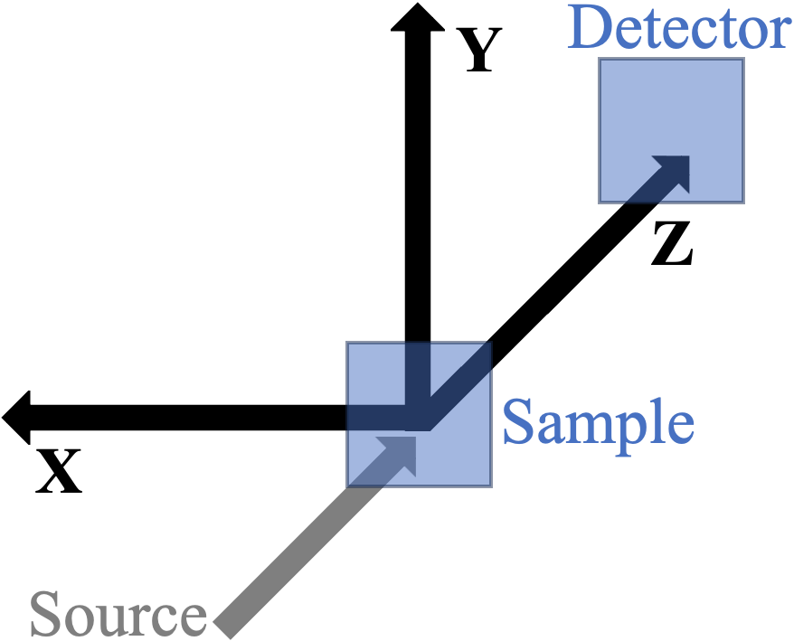
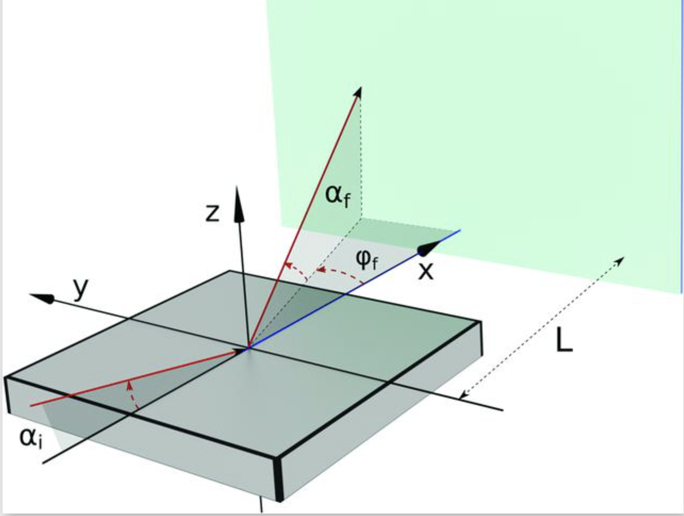
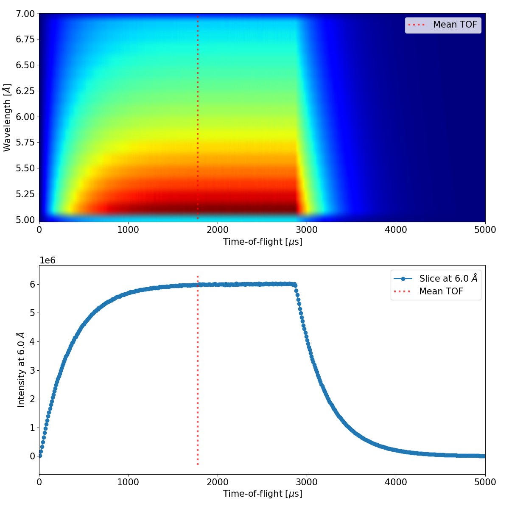

==========================
Main Modules and Processes
==========================

.. _run_simulations_with_mg_run:

Run simulations with ``mg_run`` (run.py)
----------------------------------------

This script is the core of the project, handling the simulation and processing of neutron scattering experiments. It takes neutron events from an MCPL file, applies transformations, and processes them through BornAgain simulations to generate scattering vector (Q) values for each neutron, which can be used for further analysis or plotting.

Workflow in short:
~~~~~~~~~~~~~~~~~~

- **Loading neutrons from an MCPL file**: Reads neutron events from an MCPL file created with the *MCPL_output* McStas component, and optionally applies filtering based on TOF limits and a weight cut-off limit.

- **Preconditioning the neutrons**:

  - **Coordinate transformation**: Transforms neutron parameters to express them in a coordinate system expected by BornAgain.

  - **Propagation to sample surface**: Propagates neutron events to the sample surface, optionally discarding those that would miss the sample.

  - **T0 correction**: Applies time-of-flight (TOF) correction to all neutrons, either using a fixed value or based on a McStas *TOFLambda_monitor* output.

- **Simulation**: Sets up and runs BornAgain simulations for each neutron event, calculating Q values (Qx,Qy,Qz) at the detector surface.

- **Output**: Outputs either a histogram of all Q values or a raw list of Q events (Qx,Qy,Qz, weight), depending on the user's choice.

Detailed workflow
~~~~~~~~~~~~~~~~~

.. _loading_neutrons_from_mcpl:

Loading neutrons from an MCPL file
^^^^^^^^^^^^^^^^^^^^^^^^^^^^^^^^^^

Neutrons are loaded from the specified MCPL file with filtering options to exclude some of the particles. One of the filtering options is to apply a Monte Carlo particle weight cut-off (``--input_weight_limit``) to exclude neutrons which have too low statistical weight to actually matter in the result. The other filtering option is the TOF filtering that is only intended for TOF instruments and will be discussed below. In case an instrument is indicated in the :ref:`instrument_defaults.py <instrument_defaults_module>` file as a non-TOF instrument (*'tof_instrument' : False*), the TOF filtering is turned off and all neutrons from the MCPL file are loaded and processed. For TOF instruments the default is to use TOF filtering, but it can be manually turned off with the ``--no_mcpl_filtering`` flag.

At TOF instruments the wavelength of the detection events is derived from their TOF (using calibrations), but due to the pulse structure, neutrons of a particular wavelength arrive to the detector over a short period of time, that gives a finite TOF/wavelength resolution. The TOF resolution gives TOF limits within which neutrons are considered to contribute to the same TOF/wavelength bin (slice). In a real measurement, multiple TOF/wavelength bins are measured in one go, but simulating all that would take a lot of computational resources. In order to save computational time, the current version of the code intends to simulate a single wavelength/TOF bin. Of course, knowing which neutron will contribute to a certain TOF/wavelength bin is not possible without doing the actual simulation until detection (because it is the TOF until detection that is the basis of the binning). As an approximation, however, the TOF–wavelength distribution at the sample position is used as a basis for selecting only those neutrons that are expected to contribute to the TOF/wavelength bin of interest.

When a (central) wavelength is provided, an accepted TOF range is defined automatically based on a McStas `TOFLambda_monitor <https://www.mcstas.org/download/components/3.7.9/monitors/TOFLambda_monitor.html>`__ result – defined by an *mcpl_monitor_name* field for the instrument (``--instrument``) in :ref:`instrument_defaults.py <instrument_defaults_module>` – that is assumed to describe the TOF–wavelength distribution of neutrons in the input MCPL file. (This information is actually available in the MCPL file, the need for a McStas monitor is only a temporary solution, that is expected to be eliminated later on.) The McStas monitor output file is looked for in the directory of the MCPL input file (the assumed McStas output directory), and the TOF spectrum of the wavelength bin that includes the selected wavelength (``--wavelength``) is retrieved. From this distribution the accepted TOF range is derived by fitting a Gaussian function, and finding the limits corresponding to a single FWHM range centred around mean TOF value. The accepted TOF range around the mean value can be modified by a multiplier input value (``--input_tof_range_factor``), and the reliability of the Gaussian fitting can be increased by rebinning the *TOFLambda_monitor* along the wavelength axis by a provided factor (``--input_wavelength_rebin``), that can be important for low statistics or too fine binning. The selected TOF range and the fitting can be checked visually by using the ``--tof_filtering_figure`` option to show or save the figure of the selected input TOF range and exit without doing the actual simulation. An example of such a figure can be seen below.

.. figure:: _static/images/image1.png
   :alt: Example figure for the --tof_filtering_figure option
   :align: center
   :width: 80%

   Example figure for the ``--tof_filtering_figure`` option. Other relevant input parameters used: ``--input_tof_range_factor=1 --input_wavelength_rebin=10 --wavelength=6.0``

TOF limits can be provided manually with the ``--input_tof_limits`` input option.

Note that in order to improve the efficiency of the McStas simulation, the simulated wavelength range should be limited to a reasonable range around the wavelength of interest (e.g., with the parameters *Lmin* and *Lmax* for the `ESS_butterfly <https://mcstas.org/download/components/3.7.9/sources/ESS_butterfly.html>`__ component).

With further development and strong computers it should be possible in the future to simulate multiple TOF/wavelength bins together, and produce the results for all of them simultaneously.

Due to legacy reasons, neutrons can also be loaded from a *.dat* file from a McStas *Virtual_output* component, but in that case no TOF filtering is applied.

In many cases, the simulated total intensity at the sample position may differ from the expected value based on measurements. To account for this, a uniform scaling factor (``--intensity_factor``) can be applied to the weight of all neutrons before the scattering calculations. Uniform scaling of all neutron weights results in a simple modification of the absolute intensity without altering relative properties of the beam, therefore it leads to a uniform scaling of the results. A suitable scaling factor can be derived e.g., from monitor intensities, or from the comparison of direct beam measurement and simulation.

Algorithm: TOF filtering
''''''''''''''''''''''''

(Summarizes `get_tof_filtering_limits <https://github.com/MilanKlausz/mcstas_gisans/blob/master/src/mcstas_gisans/tof_filtering.py>`__ and `get_particles <https://github.com/MilanKlausz/mcstas_gisans/blob/master/src/mcstas_gisans/input_output.py>`__ invoked from the `main <https://github.com/MilanKlausz/mcstas_gisans/blob/master/src/mcstas_gisans/run.py>`__ function.)

.. code-block:: text

   Input:
   // For determining the time window
   input_tof_limits: optional tof filtering limits set by the user
   mcstas_dir: directory containing the McStas simulation results
   monitor_name: McStas monitor name
   wavelength: central wavelength of interest
   wavelength_rebin_factor: optional integer wavelength rebinning factor
   tof_limits: optional tof limits to limit the fitted data range
   tof_range_factor: a factor to scale the width of the TOF window (default is 1.0 for one FWHM)
   
   // For reading the particles
   filename: filename of the MCPL file to read the particle events from

   Output:
   particles: A list of particle events that fall within the calculated TOF window

   // --- Read the McStas monitor file, rebin data and return 1D TOF data for a certain wavelength of interest ---
   FUNCTION get_mcstas_monitor_data(mcstas_dir, monitor_name, wavelength, wavelength_rebin_factor):
       Read the McStas monitor file (mcstas_dir/monitor_name) to get the data
       Optionally rebin the 2D (TOF-lambda) data along the wavelength axis by the wavelength_rebin_factor
       Find the wavelength_bin that contains the wavelength of interest
       Return the 1D TOF data for the wavelength_bin
   END FUNCTION

   // --- Fit Gaussian function to data from a McStas monitor file ---
   FUNCTION fit_gaussian_to_mcstas_monitor(tof_limits, ...):
       Call get_mcstas_monitor_data function to get 1D TOF data for wavelength of interest
       Fit a Gaussian function G(t) = A * exp(-(t - mu)^2 / (2 * sigma^2)) to the data points, optionally restricted to the tof_limits range.
       Parameters:
           mu: the mean time-of-flight of the pulse [μs]
           sigma: the standard deviation of the pulse [μs]
       Calculate FWHM = 2 * sigma * sqrt(2 * ln(2))
       Return mu, FWHM
   END FUNCTION

   // --- Determine the TOF limits from the monitor data ---
   FUNCTION get_tof_filtering_limits(input_tof_limits, tof_range_factor, ...):
       If instrument is not TOF, return [-inf, inf] limits
       If input_tof_limits set, return input_tof_limits
       Call fit_gaussian_to_mcstas_monitor to get (mu, FWHM)
       
       // Calculate the TOF limits based on the fit.
       t_min_us = mu - (FWHM / 2) * tof_range_factor
       t_max_us = mu + (FWHM / 2) * tof_range_factor
       
       // Convert units from microseconds (from monitor) to milliseconds (for MCPL filtering).
       t_min_ms = t_min_us * 1e-3
       t_max_ms = t_max_us * 1e-3
       Return [t_min_ms, t_max_ms]
   END FUNCTION

   // --- Filter the particles read from the MCPL file using the TOF limits ---
   FUNCTION get_particles(filename, t_min, t_max):
       Read the content of the MCPL file defined by the filename
       For each particle:
           If t_min < particle.time < t_max:
               Add particle to particles_list
       Return particles_list
   END FUNCTION

   // Main workflow execution:
   1. Call the get_tof_filtering_limits function with the monitor parameters and selected wavelength to get the tof_limits.
   2. Call the get_particles function with the MCPL filename and the tof_limits to get the particles

Relevant input options
''''''''''''''''''''''

For the full and actual list, invoke: ``mg_run -h``

- ``filename`` (positional argument): Input filename. (Preferably MCPL file from the McStas MCPL_output component, but .dat file from McStas Virtual_output works as well)
- ``--instrument, -i``: Instrument (from :ref:`instrument_defaults.py <instrument_defaults_module>`). (default: None) Current options: *saga, loki, skadi, d22*
- ``--wavelength, -w``: Central wavelength used for filtering based on the McStas TOFLambda monitor. (Also used for t0 correction.) (default: None)
- ``--input_tof_range_factor``: Modify the accepted TOF range of neutrons by this multiplication factor. (default: 1.0)
- ``--input_wavelength_rebin``: Rebin the TOFLambda monitor along the wavelength axis by the provided factor (only if no extrapolation is needed). (default: 1)
- ``--input_tof_limits``: TOF limits for selecting neutrons from the MCPL file [millisecond]. When provided, fitting to the McStas monitor is not attempted. (default: None)
- ``--input_weight_limit``: Monte Carlo particle weight limit to exclude particles of low importance. (default: 0.0)
- ``--no_mcpl_filtering``: Disable MCPL TOF filtering. Use all neutrons from the MCPL input file. (default: False)
- ``--figure_output {show,png,pdf}``: Show or save the figure of the selected input TOF range and exit without doing the simulation. Only works with McStas monitor fitting. (default: None)
- ``--intensity_factor``: A multiplication factor to modify the beam intensity. (Applied to the Monte Carlo weight of each particle in the input file.) (default: 1.0)

Coordinate transformation
^^^^^^^^^^^^^^^^^^^^^^^^^

The coordinate transformation is necessary because there are fundamental differences in the geometric conventions of McStas and BornAgain, as demonstrated in the figures below.

In McStas, the z-axis points in the direction of the beam, the x-axis is perpendicular to the beam in the horizontal plane pointing left as seen from the source, and the y-axis points upwards.

In BornAgain, however, the average sample surface defines the *xy* plane, that is always referred to as ‘horizontal’ – regardless of the orientation of the sample in laboratory space – and the mean incident beam lies in the *xz* plane, originating from the quadrant x<0, z>0.

Following the suggestion of placing the *MCPL_output* McStas component at the sample position, the neutron parameters in the MCPL file are already expressed relative to a sample at the origin, so the only task is apply coordinate rotations so that the parameters are expressed in accordance with the BornAgain conventions.

This happens in two steps: the first depends on the orientation of the sample (horizontal or vertical), and the second depends on the intended incident angle (:math:`\alpha_i`) of the beam.

If the main sample orientation is horizontal, then the difference between the McStas and BornAgain coordinate system is mostly just a cyclic permutation of the axes – apart from the difference due to the incident beam angle, that is dealt with in the second step.

If however, the main sample orientation is vertical, then depending on which side of it is hit by the beam, a :math:`\pm 90^\circ` rotation around the McStas z-axis is applied to express the neutron parameters with respect to a ‘horizontal’ sample in the BornAgain geometry.

After that, a rotation around the BornAgain y-axis by the intended incident angle on the sample is applied to make the neutrons hit a completely horizontal sample from a BornAgain geometry perspective.

The transformations are done based on two user inputs: one encoding the main sample orientation, and the other being the intended incident angle.

Note that since the incident angle is an input parameter in the BornAgain simulation script, simulating multiple sample rotations does not require re-running the McStas simulation – unless different instrument settings are needed.

It's worth mentioning that the parameter actually used by the BornAgain API is :math:`\alpha_i` (the incident angle of the neutrons on the sample), and the output is a grid of outgoing angles :math:`\varphi_i` and :math:`\varphi_f`), hence the labeling of the axes is irrelevant from the perspective of BornAgain, provided the values are handled correctly.

*Difference of the coordinate systems: (left) the* 
`NeXus coordinate system <https://manual.nexusformat.org/design.html#the-nexus-coordinate-system>`__
*used in McStas, as viewed from the detector; (right) the geometric conventions in BornAgain*
[`Source <https://www.ncbi.nlm.nih.gov/pmc/articles/PMC6998781/figure/fig4/>`__].

The sample orientation is handled by the ``--sample_orientation`` input with values [0, 1, 2]:

- **0** – vertical sample with the beam hitting it from left (in laboratory system)
- **1** – horizontal sample with the beam hitting from the top (in laboratory system)
- **2** – vertical sample with the beam hitting it from right (in laboratory system)

Algorithm: Coordinate Transform
'''''''''''''''''''''''''''''''

(Summarizes `transform_to_sample_system <https://github.com/MilanKlausz/mcstas_gisans/blob/master/src/mcstas_gisans/preconditioning.py>`__ and `sample_orientation_transform <https://github.com/MilanKlausz/mcstas_gisans/blob/master/src/mcstas_gisans/preconditioning.py>`__ invoked by the `main <https://github.com/MilanKlausz/mcstas_gisans/blob/master/src/mcstas_gisans/run.py>`__ function through the `precondition <https://github.com/MilanKlausz/mcstas_gisans/blob/master/src/mcstas_gisans/preconditioning.py>`__ function.)

.. code-block:: text

   Algorithm: Coordinate_Transform
   Input:
   Particles P (list of states with position r, velocity v, time t)
   Incident Angle alpha
   Sample Orientation mode (0, 1, or 2)
   Sample Dimensions (size_x, size_y)

   Output:
   Transformed Particles P_out

   1. // Sample Orientation Rotation (Align sample normal to Y-axis)
      For each particle p in P:
          If mode == 0 (Vertical, Left):
              r_new = [-p.r.y, p.r.x, p.r.z]
              v_new = [-p.v.y, p.v.x, p.v.z]
          Else If mode == 2 (Vertical, Right):
              r_new = [p.r.y, -p.r.x, p.r.z]
              v_new = [p.v.y, -p.v.x, p.v.z]
          Else (Horizontal):
              r_new = p.r
              v_new = p.v
          p.r = r_new
          p.v = v_new

   2. // Incident Angle Rotation (Tilt beam relative to sample surface)
      // Corresponds to rotation around X-axis by angle alpha
      Define Rotation Matrix R_x(alpha):
          [ 1,         0,          0 ]
          [ 0,  cos(alpha), -sin(alpha) ]
          [ 0,  sin(alpha),  cos(alpha) ]
      For each particle p in P:
           p.r = R_x(alpha) * p.r
           p.v = R_x(alpha) * p.v
       Return P_out

Relevant input options
''''''''''''''''''''''

For the full and actual list, invoke: ``mg_run -h``

- ``--alpha, -a``: Incident angle on the sample. [deg] (Could be thought of as a sample rotation, but it is actually achieved by an incident beam coordinate transformation.) (default: 0.24)
- ``--sample_orientation``: Orientation of the sample. 1 - horizontal sample, 0/2 - vertical sample with the beam hitting it from left/right. (default: 1) options: 0, 1, 2

Propagation to sample surface
^^^^^^^^^^^^^^^^^^^^^^^^^^^^^

Neutrons are propagated to the sample surface (z=0 in BornAgain geometry), and those which are not within the ``--sample_size_y``, ``--sample_size_x`` surface area of the sample are not processed further, unless the ``--allow_sample_miss`` option is used. This means that by default, neutrons that would miss the sample are discarded before the BornAgain simulation.

In case the incident neutrons are allowed to miss the sample, they are propagated directly toward the detector surface (transmission without refraction, but taking gravity into account). This option can be used to simulate overillumination, or direct beam simulation by also setting one of the sample sizes to zero.

:math:`t_{\text{propagate}} = - z / v_z`

Algorithm: Propagate To Sample
''''''''''''''''''''''''''''''

(Summarizes `propagate_to_sample_surface <https://github.com/MilanKlausz/mcstas_gisans/blob/master/src/mcstas_gisans/preconditioning.py>`__ invoked by the `main <https://github.com/MilanKlausz/mcstas_gisans/blob/master/src/mcstas_gisans/run.py>`__ function through the `precondition <https://github.com/MilanKlausz/mcstas_gisans/blob/master/src/mcstas_gisans/preconditioning.py>`__ function.)

.. code-block:: text

   Algorithm: Propagate_To_Sample
   Input:
   Particles P (list of states with position r, velocity v, time t)
   Sample Dimensions (size_x, size_y)

   Output:
   Transformed Particles P_out

   1. // Propagate to Sample Surface (y = 0 plane in McStas coordinate system)
      For each particle p in P:
          // Calculate time to intersection
          dt = -p.r.y / p.v.y
          // Update position and time
          p.r = p.r + p.v * dt
          p.time = p.time + dt

   2. // Filter particles missing the sample
      // Note: x is transverse (width), z is longitudinal (length) on the surface
      P_out = empty list
      For each particle p in P:
          If |p.r.x| < size_y/2 AND |p.r.z| < size_x/2:
              Add p to P_out
      Return P_out

Relevant input options
''''''''''''''''''''''

For the full and actual list, invoke: ``mg_run -h``

- ``--sample_size_y``: Size of sample perpendicular to beam. [m] (default: 0.06)
- ``--sample_size_x``: Size of sample along the beam. [m] (default: 0.08)
- ``--allow_sample_miss``: Allow incident neutrons to miss the sample, and be directly propagated to the detector surface. This option can be used to simulate overillumination, or direct beam simulation by also setting one of the sample sizes to zero. (default: False)

.. _t0_correction_section:

T0 correction
^^^^^^^^^^^^^

The last preconditioning step is an optional t0 correction, that is intended to account for the pulse width, by adjusting each neutron’s TOF value by a certain t0 value. This step is only needed for accurate data reduction, as the BornAgain API uses the ‘real’ wavelength for the neutron–sample interaction, not the derived wavelength calculated from the TOF and pathlength.

The value of t0 can either be a fixed (``--t0_fixed``) that is subtracted from each neutron's TOF – allowing the user to make calculations based on chopper settings for example – or it can be calculated using a *TOFLambda_monitor* McStas monitor placed at the source position (*t0_monitor_name* in :ref:`instrument_defaults.py <instrument_defaults_module>`). For the latter case, as demonstrated in the figure below, t0 is calculated as the mean value (weighted average) of the TOF spectrum for the wavelength bin containing the wavelength of interest(``--wavelength``).

Due to the pulse structure of TOF instruments, without a t0 correction, the TOF of all neutrons would be overestimated by their initial time at the source position. By subtracting a t0 value from the TOF of all neutrons, the reference point of the TOF is shifted from the beginning of the pulse by that amount. When using a mean value of the initial time at the source position, roughly half of the neutrons will have their TOF slightly underestimated, and the other half slightly overestimated. This approach incorporates the uncertainty of the TOF introduced by the pulse width, just as expected in a real TOF measurement.

   Demonstration of defining t0 automatically based on a TOF–wavelength McStas monitor at the source position (top). The relevant wavelength bin containing the wavelength of interest (6.0 Å) is retrieved, and the mean value is defined as the weighted average (bottom).

.. _wfm_mode_section:

Wavelength Frame Multiplication (WFM) mode
'''''''''''''''''''''''''''''''''''''''''''

By default the mean TOF value calculation using weighted average of the histogram is done for the full TOF range, but if the Wavelength Frame Multiplication (WFM) mode is used (``--wfm``), it is carried out on a restricted section of the TOF spectrum, that corresponds the subpulse containing the neutrons for the selected wavelength. In the current implementation, these TOF ranges are hardcoded for the SAGA instrument (using hardcoded wavelength dependent subpulse ids, and hardcoded subpulse TOF limits).

The WFM mode requires a special *wfm_t0_monitor_name* entry in :ref:`instrument_defaults.py <instrument_defaults_module>` (that is used instead of monitor defined by the *t0_monitor_name*), and a *wfm_virtual_source_distance* entry as well, which describes the real source to virtual source distance, that needs to be subtracted from the flight path when the wavelength of a neutron is calculated from its TOF.

The T0 correction can be completely skipped by ``--no_t0_correction`` input option.

In the future there should be an option to output the T0 correction figures (`GitHub issue tracker #2 <https://github.com/MilanKlausz/mcstas_gisans/issues/2>`__).

Algorithm: T0 correction
''''''''''''''''''''''''

(Summarizes `apply_t0_correction <https://github.com/MilanKlausz/mcstas_gisans/blob/master/src/mcstas_gisans/preconditioning.py>`__ invoked by the `main <https://github.com/MilanKlausz/mcstas_gisans/blob/master/src/mcstas_gisans/run.py>`__ function through the `precondition <https://github.com/MilanKlausz/mcstas_gisans/blob/master/src/mcstas_gisans/preconditioning.py>`__ function.)

.. code-block:: text

   Algorithm: T0 correction
   Input:
   input_particles: A list of particle events.
   // Parameters to determine the correction value
   t0_fixed: Optional fixed t0 correction value [s]
   is_wfm_mode: Boolean, true if Wavelength Frame Multiplication is used.
   wavelength: The central wavelength of interest.
   mcstas_dir: Path to the directory containing McStas monitor files.
   instrument_parameters: A structure containing instrument-specific settings.
   wavelength_rebin_factor: optional integer wavelength rebinning factor

   Output:
   corrected_particles: A list of particle events with adjusted time.

   // --- Helper Function: Get WFM sub-pulse TOF limits ---
   FUNCTION get_wfm_subpulse_limits(wavelength):
       // These are instrument-specific, predefined values until a more sophisticated method is implemented
       // Example for SAGA instrument:
       If wavelength < 5.15: Return [10200, 12000] // in microseconds
       Else If wavelength < 6.15: Return [12000, 14300]
       Else If wavelength < 7.1: Return [14300, 16100]
       Else: Return [16100, 18000]
   END FUNCTION

   // --- Read the McStas monitor file, rebin data and return 1D TOF data for a certain wavelength of interest ---
   FUNCTION get_mcstas_monitor_data(mcstas_dir, monitor_name, wavelength, wavelength_rebin):
       Read the McStas monitor file (mcstas_dir/monitor_name) to get the data
       Optionally rebin the 2D (TOF-lambda) data along the wavelength axis by the wavelength_rebin factor
       Find the wavelength_bin that contains the wavelength of interest
       Return the 1D TOF data for the wavelength_bin
   END FUNCTION

   // --- Part 1: Determine the time correction value (t0_correction) ---
   FUNCTION find_mcstas_monitor_tof_centre(TOF_limits, ...):
       // Load and extract the relevant 1D TOF spectrum
       Call the get_mcstas_monitor_data function to get the 1D TOF data for the wavelength of interest. Returns TOF_spectrum and corresponding TOF_bins
       
       // Create a mask to select data within the TOF limits. If TOF_limits are not set (not in wfm mode), then use the monitor limits
       // Finalize TOF limits for the calculation
       If TOF_limits[0] is not_set: TOF_limits[0] = monitor_TOF_min
       If TOF_limits[1] is not_set: TOF_limits[1] = monitor_TOF_max
       mask = (TOF_bins >= TOF_limits[0]) AND (TOF_bins <= TOF_limits[1])
       TOF_bins_limited = TOF_bins[mask]
       TOF_spectrum_limited = TOF_spectrum[mask]
       
       // Calculate the center of mass (using the find_centre helper function)
       numerator = sum(TOF_bins_limited[i] * TOF_spectrum_limited[i] for all i)
       denominator = sum(TOF_spectrum_limited[i] for all i)
       tof_centre = numerator / denominator
       Return tof_centre
   END FUNCTION

   // Main workflow execution (apply_t0_correction):
   If t0_fixed is provided:
       t0_correction = t0_fixed
   Else:
       // Select monitor name and TOF limits based on operation mode
       If is_wfm_mode is true:
           monitor_name = instrument_parameters.wfm_t0_monitor_name
           TOF_limits = get_wfm_subpulse_limits(wavelength)
       Else:
           monitor_name = instrument_parameters.t0_monitor_name
           TOF_limits = [not_set, not_set] // Will use full range from monitor
       Call find_mcstas_monitor_tof_centre(monitor_name, TOF_limits, ...) to get tof_centre value to be used as t0_correction

   For each particle p in input_particles:
       p.time = p.time - t0_correction
   Return t0 corrected particles

Relevant input options
''''''''''''''''''''''

For the full and actual list, invoke: ``mg_run -h``

- ``--instrument, -i``: Instrument (from :ref:`instrument_defaults.py <instrument_defaults_module>`). (default: None) Current options: *saga, loki, skadi, d22*
- ``--wavelength, -w``: Central wavelength used for filtering based on the McStas TOFLambda monitor. (Also used for t0 correction.) (default: None)
- ``--t0_fixed``: Fix T0 correction value that is subtracted from the neutron TOFs. (default: None)
- ``--t0_wavelength_rebin``: Rebinning factor for the McStas TOFLambda monitor based t0 correction. Rebinning is applied along the wavelength axis. Only integer divisors are allowed. (default: 1)
- ``--wfm``: Wavelength Frame Multiplication (WFM) mode. (default: False)
- ``--no_t0_correction``: Disable t0 correction. (Allows using McStas simulations which lack the supported monitors.) (default: False)
- ``--t0_correction_figure``: Show or save the figure of the t0 correction and exit without doing the simulation. Only works with McStas monitor fitting. (default: None)

Neutron simulation and output
^^^^^^^^^^^^^^^^^^^^^^^^^^^^^

For each neutron, a BornAgain simulation is set up and run separately, calculating scattering vector (Q) values at the detector after propagating the array of outgoing rays each neutron produces to the detector surface. For each neutron a new `SphericalDetector <https://bornagainproject.org/21/ref/instr/det/spherical-detector/>`__ is set up with the number of bins provided by the used (``--outgoing_direction_number``) in both the alpha and phi outgoing angle ranges (``--angle_range``). If an angle range is not provided by a user, it will be calculated from the detector size and sample--detector distance. In this case the horizontal and vertical opening angles can be different -- as opposed to the case when the user provides the angle range, which is then used for both directions.

In order to better sample the scattering direction space, an additional randomization is introduced, shifting the outgoing direction array from pointing to the centre of the pixels to a random point within the pixels, thus producing a unique set of scattering directions for every simulated neutron. This random sampling approach is essential because in BornAgain, by default the distorted-wave Born approximation (DWBA) cross section is only evaluated at the centre of the pixels, unless the `Monte-Carlo integration <https://bornagainproject.org/21/ref/sim/setup/options/mc/>`__ option is selected, in which case the cross-section is evaluated in multiple random directions within each pixel. The BornAgain Monte Carlo integration option makes perfect sense in the BornAgain application, where the outgoing direction is directly linked to a detector pixel, with no further propagation of the neutron ray, and a more finely sampled scattering cross-section can still resolve issues with narrow peaks. In the case of mcstas_gisans, however, where further propagation of neutron rays is carried out, having multiple outgoing rays in different directions with corresponding scattering probabilities is much better than having fixed outgoing directions even if the average scattering probability within the pixel would be the same.

Mathematically both solutions are essentially the same Monte Carlo integral approximation of the scattering cross-section, however in the case of BornAgain, the average scattering probability is attributed to the direction toward the centre of the pixel, while in mcstas_gisans, the scattering intensity is distributed among multiple neutron rays with different directions within the pixel. In each case, the calculated differential scattering cross section is normalized by the solid angle covered by each pixel in order to get the probabilities of scattering toward each pixel.

The three parameters needed for the BornAgain simulation (for the BornAgain API call) are the sample, that can be provided by a path, or selected from the inbuilt models in the `src/mcstas_gisans/samples/ <https://github.com/MilanKlausz/mcstas_gisans/tree/master/models>`__ directory; the neutron wavelength, that is calculated from the velocity for each neutron; and the intensity of the `Beam <https://bornagainproject.org/21/ref/instr/beam/>`__, for which the statistical weight of each neutron is used. Parametrized sample models are supported by an arbitrary list of arguments and values (``--sample_arguments``) in the format: ``"arg1=value1; arg2=value2"`` that are all passed to the sample model. Note that values are attempted to be converted to integers or floating-point numbers, which might cause issues in case of string inputs.

The result of the BornAgain simulation (for each neutron separately) is the intensity of the neutron ray in each outgoing direction described above, that is the incident intensity (statistical weight of the incident neutron) multiplied by the probability of the neutron scattering in that particular direction. This effectively means that each incident neutron produces :math:`\text{outgoing\_direction\_number} \times \text{outgoing\_direction\_number}` outgoing neutrons. All of these neutrons are propagated to the detector surface, where the Q value defined below is calculated:

:math:`\vec{Q} = (\vec{v}_{\text{out}} - \vec{v}_{\text{in}}) \cdot \left(\frac{2 \pi}{\lambda}\right)`

where :math:`\vec{v}_{\text{in}}` and :math:`\vec{v}_{\text{out}}` are the incident and outgoing direction vectors, and :math:`\lambda` is the wavelength.

The intent is to acquire a Q value that is close to the one that could be derived from a real measurement, so the following considerations are made during the calculations:

1) The **outgoing direction vector** is calculated from the centre of the sample as the point of scattering (not the actual point of scattering on the sample surface), and the end point is the centre of the detector pixel the neutron enters (not the actual intersection of the outgoing neutron with the detector surface). Optionally, the pixel the neutron enters can be defined after a Gaussian smearing of the intersection point coordinates, mimicking the detection process and resolution. The propagation of the neutrons to the detector surface is based on the *sample_detector_distance* and the optional *beam_declination_angle* provided in :ref:`instrument_defaults.py <instrument_defaults_module>`, under the assumption that the detector surface is vertical. In this propagation gravity is taken into account, unless it's turned off (``--no_gravity``).

2) The **incident direction vector** is calculated purely from the intended incident angle on the sample -- not the actual angle of incidence --, without any regard to the beam divergence.

3) The **wavelength** is calculated from the total TOF until the detector surface, and the total flight path (*nominal_source_sample_distance* + *sample_detector_path_length*) for TOF instruments. In case of non-TOF instruments the :math:`\left(\frac{2 \pi}{\lambda}\right)` factor is calculated with the wavelength selector's wavelength (``--wavelength``). In case of :ref:`WFM <wfm_mode_section>` mode, the flight path of the neutron is reduced by the *wfm_virtual_source_distance* parameter from :ref:`instrument_defaults.py <instrument_defaults_module>`, as its :ref:`T0 corrected <t0_correction_section>` TOF corresponds to that starting point instead of the real neutron source.

Algorithm: Calculate Q
''''''''''''''''''''''

(Summarizes `calculate_q <https://github.com/MilanKlausz/mcstas_gisans/blob/master/src/mcstas_gisans/instrument.py>`__ invoked by the `main <https://github.com/MilanKlausz/mcstas_gisans/blob/master/src/mcstas_gisans/run.py>`__ function through `process_particles <https://github.com/MilanKlausz/mcstas_gisans/blob/master/src/mcstas_gisans/run.py>`__ directly, or indirectly through `process_particles_parallelly <https://github.com/MilanKlausz/mcstas_gisans/blob/master/src/mcstas_gisans/run.py>`__)

.. code-block:: text

   Algorithm: calculate Q
   Input:
   x, y, z, VX, VY, VZ: position and velocity of the particle at the sample surface

   // Instrument and simulation parameters
   incident_angle_deg: incident angle on the sample
   nominal_source_sample_distance: nominal distance from neutron source to sample
   sample_detector_distance: nominal sample to detector distance
   wavelength_selected: wavelength selected for non-TOF instruments
   Fixed_Wavenumber // (for non-TOF)
   gravity_acceleration_vector: gravity vector in BornAgain coord system

   // Detector parameters
   pixel_size_x, pixel_size_y: detector pixel size
   min_edge_x, min_edge_y: detector edges
   detector_resolution_x, detector_resolution_y: detector resolution (FWHM)

   Output:
   Q_vector: scattering vector

   // --- Calculate the effect of gravity during the propagation to detector surface ---
   FUNCTION calculate_gravity_drop(gravity_acceleration_vector, sample_detector_distance):
       t_propagate_square_half = 0.5 * t_propagate**2
       x_drop = gravity_acceleration_vector[0] * t_propagate_square_half
       y_drop = gravity_acceleration_vector[1] * t_propagate_square_half
       z_drop = gravity_acceleration_vector[2] * t_propagate_square_half
       return x_drop, y_drop, z_drop
   END FUNCTION

   // --- Intersection with detector plane ---
   FUNCTION detector_plane_intersection(x, y, z, VX, VY, VZ, sample_detector_distance):
       Call the transform_to_nexus_coordinate_system function to get the z_rot position and vz_rot velocity component in the Nexus coordinate system
       
       // Calculate propagation time until the detector surface under the assumption that the detector surface is vertical in the Nexus coord system
       t_propagate = (sample_detector_distance - z_rot) / vz_rot
       x_intersection = VX * t_propagate + x
       y_intersection = VY * t_propagate + y
       z_intersection = VZ * t_propagate + z
       
       if not self.no_gravity:
           // Adjust the intersection point with gravity effect for t_propagate
           x_drop, y_drop, z_drop = calculate_gravity_drop(t_propagate)
           x_intersection += x_drop
           y_intersection += y_drop
           z_intersection += z_drop
       
       return t_propagate, x_intersection, y_intersection, z_intersection
   END FUNCTION

   // --- Get the coordinate of the detection event from the position where the path of the particle intersects the plane of the detector surface. ---
   FUNCTION calculate_detection_coordinate(x_det_BA, y_det_BA, z_det_BA, detector_resolution_x, detector_resolution_y):
       // Transform intersection point to Nexus frame (note: x_det_nexus = x_det_BA)
       y_det_nexus, z_det_nexus = transform_to_nexus_coordinate_system(y_det_BA, z_det_BA)
       
       // Apply detector resolution smearing
       det_sigma_x = detector_resolution_x / 2.355
       det_sigma_y = detector_resolution_y / 2.355
       pos_smeared_nexus_x = x_det_nexus + Gaussian_Random(mean=0, stddev=det_sigma_x)
       pos_smeared_nexus_y = y_det_nexus + Gaussian_Random(mean=0, stddev=det_sigma_y)
       
       // Digitize to find the center of the hit pixel
       x_pixel_centre = np.floor((pos_smeared_nexus_x - min_edge_x) / pixel_size_x) * pixel_size_x + 0.5 * pixel_size_x + min_edge_x
       y_pixel_centre = np.floor((pos_smeared_nexus_y - min_edge_y) / pixel_size_y) * pixel_size_y + 0.5 * pixel_size_y + min_edge_y
       pos_pixel_center_nexus = [pos_pixel_center_Nexus_X, pos_pixel_center_Nexus_Y, sample_detector_distance]
       
       // Transform final detection coordinate back to BornAgain frame
       pos_detection_BA = transform_to_bornagain_coordinate_system(pos_pixel_center_nexus, sample_inclination_deg)
       return pos_detection_BA
   END FUNCTION

   // Main workflow execution (calculate_q):
   // Get time of propagation and intersection point with the detector plane
   sample_detector_tof, x_detector_plane, y_detector_plane, z_detector_plane = detector_plane_intersection(x, y, z, VX, VY, VZ, sample_detector_distance)

   Call calculate_detection_coordinate function to get detection coordinates from the intersection position

   sample_detector_path_length = norm(detection_coordinate)
   outgoing_direction_vector = detection_coordinate / sample_detector_path_length

   // Calculate the wavenumber
   If is_TOF_instrument is true:
       path_length_total = nominal_source_sample_distance + sample_detector_path_length
       tof_total = tof_to_sample + sample_detector_tof
       
       // (h / m_neutron) = (Planck constant / neutron mass) = 3956.034012
       wavelength = (h / m_neutron) * tof_total / path_length_total
       wavenumber = 2 * PI / wavelength
   Else:
       // wavenumber is a pre-calculated constant for non-TOF instruments
       fixed_wavenumber = 2 * PI / (wavelength_selected)
       wavenumber = fixed_wavenumber

   incident_angle_rad = deg2rad(incident_angle_deg)
   incident_direction = [0, -sin(incident_angle_rad), cos(incident_angle_rad)]
   Q_vector = wavenumber * (outgoing_direction_vector - incident_direction)

   Return Q_vector

.. _detector_definition_section:

Detector definition
~~~~~~~~~~~~~~~~~~~

A detector can be defined for each instrument in the :ref:`instrument_defaults.py <instrument_defaults_module>` file in the following format:

.. code-block:: python

   'detector': {
       'size': [0.0838, 0.1062], #[m]
       'centre_offset': [0.0, 0.0262], #[m]
       'pixels': [487, 689],
       'resolution': [0.0, 0.0] #fwhm[m]
   },

All value pairs are defined in the [y, z] directions BornAgain coordinate system.

The *centre_offset* values define the offset of the detector centre with respect to the direct beam. Note that the detector surface is assumed to be vertical in the laboratory system. If the direct beam is not horizontal, it should be indicated through the *beam_declination_angle* parameter in :ref:`instrument_defaults.py <instrument_defaults_module>` for the correct propagation to the detector surface.

The resolution parameter can be set optionally to mimic the physical resolution of the detector, by applying a Gaussian smearing of the given FWHM value to the neutron--detector surface intersection coordinates before the corresponding pixel centre is defined. The effect of pixellations is based on the *pixels* parameter (and the *size* of the detector), so this parameter should only account for the statistical processes behind the detection processes (e.g., local scattering; neutron gets converted → conversion products deposit energy over some volume → charge drift to electrodes; readout electronics).

If the *detector* field is not defined for the instrument chosen for the simulation, the parameter from the *default_detector* (in :ref:`instrument_defaults.py <instrument_defaults_module>`) are used.

Note that the detector parameters can be used to define the output Q histogramming, described in the :ref:`Output <output_section>` section.

.. _output_section:

Output
~~~~~~

The result of the simulation and Q calculation is a list of Q events (weight, Qx, Qy, Qz) for each neutron. Depending on the input options, the list of Q events are either saved together with other neutron's Q events in a large file (old raw format with ``--raw_output``), or they are histogrammed and added to a cumulative histogram where all other neutrons result are added, and saved in the end in an `NPZ file <https://numpy.org/doc/stable/reference/generated/numpy.savez.html>`__. The range covered by the histogram along each axis (``--x_range``, ``--y_range``, ``--z_range``), and the number of bins (``--bins``) in each direction can be controlled by input values, which will in terms define how large the output file will be. In case these parameters are not provided by the user, Q limits and bin number are calculated from the selected wavelength and the detector's parameters (sample--detector distance, detector size, detector offset).

With the histogrammed output, a quick Qy--Qz plot can also be created with the ``--quick_plot`` option, that is intended for peaking at the results locally, at the end of a low statistics simulation. For proper plotting, the output file containing the histograms should be used following the instructions in the :ref:`Plot simulation results <plot_simulation_results_section>` section.

Note that in case the Q histogramming parameters (``--x_range``, ``--y_range``, ``--z_range``, ``--bins``) are not defined, suitable values are calculated from the detector parameters using:

- the sample--detector distance and detector size (+centre offset) to get maximum opening angles
- the wavelength of interest (``--wavelength`` / ``--wavelength_selected``) to calculate Q limits for the maximum opening angles
- pixel number as number of histogram bins

Parallel processing
~~~~~~~~~~~~~~~~~~~

The script supports parallel processing to speed up the simulation by distributing the workload across multiple cores. The default option is to use parallelisation with all available CPU cores minus two. Parallel processing can be turned off (``--no_parallel``), or limited to a certain number of cores (``--parallel_processes``). The implementation of parallelization is quite simple; instead of running the *processNeutrons* function to carry out the BornAgain simulation and subsequent calculation of each incident neutron (separately) on the complete array of incident neutron events, the array is broken into even chunks to be processed with the same *processNeutrons* function by the parallel processes, and then the results are merged.

BornAgain options
~~~~~~~~~~~~~~~~~

- ``--use_avg_materials``: sets `sim.options().setUseAvgMaterials(True) <https://bornagainproject.org/21/ref/sim/setup/options/avgmat/>`__ so that the refractive properties of material layers are computed by taking the average of the matrix material and the embedded particles.
- ``--include_specular``: sets `sim.options().setIncludeSpecular(True) <https://bornagainproject.org/21/ref/sim/setup/options/specular/>`__ to include the specular reflected beam intensity along with the scattered intensity in a GISAS simulation.

Notes and warnings
~~~~~~~~~~~~~~~~~~

- It should be known that the raw list of Q events (``--raw_output``) can take up a lot of memory -- as they are kept in the memory together until the end of simulation, when they are saved in one step to an NPZ file --, that **can lead to memory issues or even crash the computer**, in case of the combination of a high number of incident neutrons and a high number of outgoing directions (``--outgoing_direction_number``).
- There is an **error in the propagation to the detector surface if the incident beam is not perpendicular to the detector surface**. (It is assumed that the end of the last guide section is horizontal, which might not be the case, as it isn't the case with SAGA).

All Input Options for ``mg_run``
~~~~~~~~~~~~~~~~~~~~~~~~~~~~~~~~

For the full and actual list, invoke: ``mg_run -h``

- ``filename`` (positional argument): Input filename. (Preferably MCPL file from the McStas MCPL_output component, but .dat file from McStas Virtual_output works as well)
- ``--instrument, -i``: Instrument (from instrument_defaults.py). (default: None) Current options: *saga, loki, skadi, d22*
- ``--parallel_processes, -p``: Number of processes to be used for parallel processing. (default: None)
- ``--no_parallel``: Do not use multiprocessing. This makes the simulation significantly slower, but enables profiling. Uses ``--raw_output`` implicitly. (default: False)
- ``--outgoing_direction_number, -p``: Number of outgoing directions (in both x and y) within the sampled angle range of the BornAgain simulation. (default: 20)
- ``--wavelength_selected``: Wavelength (mean) in Angstrom selected by the velocity selector. Only used for non-time-of-flight instruments. (default: 6.0)
- ``--angle_range``: Scattering angle covered by the simulation. [deg] (default: 1.7)
- ``--alpha, -a``: Incident angle on the sample. [deg] (Could be thought of as a sample rotation, but it is actually achieved by an incident beam coordinate transformation.) (default: 0.24)
- ``--model, -m``: BornAgain model to use. Can be: the name of a built-in model (e.g. 'silica_100nm_air'), or a path to a custom Python file defining a sample model. Built-in model options: *hexagonal_spheres, lamellas_and_spheres, silica_100nm_D2O, silica_100nm_air, silica_air* (default: silica_100nm_air)
- ``--sample_arguments``: Input arguments passed to the sample model in the following format: ``"arg1=value1;arg2=value2"``. (default: "")
- ``--savename, -s``: Output filename (can be full path). (default: "")
- ``--raw_output``: Create a raw list of Q events as output instead of the default histogrammed data. Warning: this option may require too much memory for high incident event and pixel numbers. (default: False)
- ``--bins``: Number of histogram bins in x,y,z directions (In BornAgain geometry). (default: None)
- ``--x_range``: Qx range of the histogram. (In BornAgain geometry). Default calculated from detector parameters. (default: None)
- ``--y_range``: Qy range of the histogram. (In BornAgain geometry). Default calculated from detector parameters. (default: None)
- ``--z_range``: Qz range of the histogram. (In BornAgain geometry). Default wide enough to include everything. (default: None)
- ``--quick_plot``: Show a quick Qy-Qz plot from the histogram result. (default: False)
- ``--all_q``: Calculate and save multiple Q values, each with different levels of approximation (from real Q calculated from all simulation parameters to the default output value, that is Q calculated at the detector surface). This results in significantly slower simulations (especially due to the lack of parallelisation), but can shed light on the effect of e.g., divergence and TOF to lambda conversion on the derived Q value, in order to gain confidence in the results. (default: False)
- ``--no_gravity``: Do not take into account gravity.
- ``--use_avg_materials``: BornAgain - use average materials option: "the refractive properties of material layers are computed by taking the average of the matrix material and the embedded particles". (default: False)
- ``--include_specular``: BornAgain - include specular reflection option: "to include the specular reflected beam intensity along with the scattered intensity in a GISAS simulation". (default: False)

Example Command
~~~~~~~~~~~~~~~

.. code-block:: bash

   mg_run /path/to/MCPL_file.mcpl --instrument saga --model lamellas_and_spheres --outgoing_direction_number 20 --wavelength 4.5 --y_range -0.1 0.5 --parallel_processes 7 --quick_plot --use_avg_materials --include_specular

This command runs a simulation using 7 parallel processes, using the SAGA instrument parameters with the `lamellas_and_spheres <https://github.com/MilanKlausz/mcstas_gisans/blob/master/models/lamellas_and_spheres.py>`__ sample model, a wavelength of 4.5 Angstroms, outputs a Q histogram, and generates a quick Qx--Qz plot of the results.

.. _plot_simulation_results_section:

Plot simulation results with ``mg_plot`` (plot.py)
--------------------------------------------------

This script is used for plotting Q values derived from the simulation results, offering options for creating 2D and 1D plots, comparing multiple datasets, and adjusting plot parameters. A key feature of this script is the option to upscale the simulation results to a certain experiment time by adjusting the values and uncertainties in order to make the results comparable to real measured data.

.. _input_files_section:

Input files
~~~~~~~~~~~

Input files can be provided with the ``--filename`` input option. The two handled formats are:

1) the histogrammed data files from the :ref:`mg_run <run_simulations_with_mg_run>` script, that is the default output option.

2) raw Q events file from the :ref:`mg_run <run_simulations_with_mg_run>` script, that is the old output format (still available with ``--raw_output`` input option). This file contains a list of Q events that need to be histogrammed for plotting, that will be carried out based on the input values into ``--bins`` number of histogram bins, within the ``--y_range, --z_range`` Qy and Qz ranges.

There is a special third format that serves for reading measured data. The current implementation in the :ref:`read_d22.py <read_d22_module>` module is a dedicated (hardcoded) function to retrieve 2D histogram data (with uncertainty and bin edges) from nexus files that correspond to measurements carried out at the D22 instrument at ILL. The path to the nexus file can be provided with the ``--nxs`` input option.

Multiple files can be provided of either format, with optional labels (``--label``) that has to be provided in the same order as the files (without provided labels, the file names themselves will be used). This can be particularly important for overlay plots, described in :ref:`Plotting options <plotting_options_section>`, where the labels are used in the legend.

Relevant input options
^^^^^^^^^^^^^^^^^^^^^^

For the full and actual list, invoke: ``mg_plot -h``

- ``--filename, -f``: Input filename[s].
- ``--label, -l``: Label for input[s].
- ``--bins``: Number of histogram bins in x,y directions.
- ``--y_range``: Qy range of the histogram. (In horizontal plane right to left)
- ``--z_range``: Qz range of the histogram. (In vertical plane bottom to top)
- ``--nxs``: Full path to the D22 Nexus file.

.. _plotting_options_section:

Plotting options
~~~~~~~~~~~~~~~~

The default option of the plotting script is to create two separate plots for each input file:

1) 2D Qy--Qz plot of the ``--y_plot_range`` and ``--z_plot_range`` Qy and Qz ranges, and the minimum value set to ``--intensity_min``. If a minimum intensity is not provided, the value of 1e-9 will be used, unless the values are upscaled, as described in :ref:`Scaling to absolute measurement times <scaling_to_absolute_measurement_times_section>`, in which case the default minimum value is 1.

2) 1D Qy plot, that depicts the intensity values of a certain ``--q_min`` to ``--q_max`` Qy range summed along the Qy axis. For this, both the Qz bin containing the ``--q_min`` value, and the Qz bin containing the ``--q_max`` value are included. Error propagation is used for the summation along the Qz axis for the error bars.

Using the ``--dual_plot`` option, the above described two plots will be created in the same figure, below each other, with the Qy axis kept matched for any manipulation through the figure's user interface (e.g., zooming). Using the ``--overlay`` option, a figure with two rows of plots will be created, similarly as with the dual plot option. The top row will depict the 2D Qy--Qz plot of each provided input file separately, while the bottom row will show one plot with all the 1D Qy plots of the selected Qz range (as described above). This option is intended for comparing different results, e.g., simulated results of different instruments (or different instrument settings), or simulated and measured data (as was the case with the D22 measured data, mentioned in :ref:`Input files <input_files_section>` in connection with the ``--nxs`` input option).

The default output of the plotting script is the shown figure(s) without any output file created. This can be changed by providing the output file format with either ``--png`` or ``--pdf``, and optionally the output file name with the ``--savename`` option.

Relevant input options
^^^^^^^^^^^^^^^^^^^^^^

For the full and actual list, invoke: ``mg_plot -h``

- **--savename, -s**: Output image filename.
- **--pdf**: Export figure as pdf.
- **--png**: Export figure as png.
- **--experiment_time, -t**: Experiment time in seconds to scale the results up to. (e.g., 10800)
- **--verbose, -v**: Verbose output.
- **--dual_plot, -d**: Create a dual plot in a single figure.
- **--overlay**: Overlay stored data with simulated data.
- **--intensity_min, -m**: Intensity minimum for the 2D q plot colorbar.
- **--q_min, -q**: Vertical component of the Q values of interest. Used as the minimum of the range if q_max is provided as well.
- **--q_max**: Maximum of the vertical component of the Q range of interest.
- **--y_plot_range**: Plot y range.
- **--z_plot_range**: Plot z range.

.. _scaling_to_absolute_measurement_times_section:

Scaling to absolute measurement times
~~~~~~~~~~~~~~~~~~~~~~~~~~~~~~~~~~~~~

Due to the source definitions, the output of a McStas simulation is usually normalised to 1 second, so the content of the MCPL output file corresponds to the neutron intensity (neutrons per second) -- of the simulated wavelength range -- at the sample position regardless of e.g., the number of simulated source pulses. This is achieved by adjusting the statistical (Monte Carlo) weight of the simulated particles. The BornAgain simulation splits each neutron into multiple neutrons with different outgoing directions and greatly reduced weights -- dividing the total weight of the incident neutron among the multiple outgoing neutrons, and adjusting each by the probability of scattering in their particular outgoing direction --, but the statistical weights still correspond to the neutron intensity (neutrons per second) on the detector surface. This means that without further processing, any Q plot created from the simulation results corresponds to 1 second 'virtual experiment' time. Due to the Monte Carlo variance reduction techniques, and the possibility of partial neutron weights, even a 1 second long virtual experiment can yield the expected patterns in the results, but with unrealistically low intensities and statistical uncertainties.

A key feature of this script is the option to upscale the simulation results to a certain experiment time (``--experiment_time``) in order to make the results comparable to real measured data. For simulating actual experiments, the intensities are scaled by the given counting time, and Poisson statistics are applied to obtain realistic neutron counts. The scaling is applied as a simple multiplication factor, then each bin's value is sampled from a Poisson distribution where the lambda parameter (that is also the expected value) is equal to the simulated result of that bin.

In order to achieve better agreement with the measured data, an option to add Poisson background (``--background``) to the simulated data is provided. This step is purely cosmetic and does not correspond to any underlying physical process, serving only for visualization purposes.

Example command to upscale the results of the :ref:`Basic usage example <basic_usage_example>` to 1 hour measurement time:

.. code-block:: bash

   mg_plot --filename test_q.npz --experiment_time 3600

Algorithm: Upscale to Experiment Time
^^^^^^^^^^^^^^^^^^^^^^^^^^^^^^^^^^^^^^

(Summarizes `upscale_simple <https://github.com/MilanKlausz/mcstas_gisans/blob/master/src/mcstas_gisans/experiment_time.py>`__ invoked by the `main <https://github.com/MilanKlausz/mcstas_gisans/blob/master/src/mcstas_gisans/plot.py>`__ function of the `plot.py <https://github.com/MilanKlausz/mcstas_gisans/blob/master/src/mcstas_gisans/plot.py>`__ plotting script through the `get_datasets <https://github.com/MilanKlausz/mcstas_gisans/blob/master/src/mcstas_gisans/plot.py>`__ function)

.. code-block:: text

   Algorithm: upscale to experiment time
   Input:
   hist: simulated intensity histogram
   experiment_time: experiment time to upscale the results to
   background: background count to be added

   Output:
   Upscaled intensity and uncertainty histogram

   1. // Calculate the expected number of counts for each bin
      // This scales the rate by time and adds the flat background
      expected_counts = (hist * experiment_time) + background

   2. // Apply Poisson statistics
      // Generate a random integer for each bin from a Poisson distribution
      // where the mean (lambda) is the expected_counts for that bin.
      hist_scaled = Random_Poisson(lambda = expected_counts)

   3. // Estimate the statistical error
      sigma_scaled = Sqrt(N_obs)

   4. Return hist_scaled, sigma_scaled

Relevant input options
^^^^^^^^^^^^^^^^^^^^^^

For the full and actual list, invoke: ``mg_plot -h``

- ``--experiment_time, -t``: Experiment time in seconds to scale the results up to. (e.g., 10800)
- ``--background``: Add Poisson background to each bin.

All Input Options for ``mg_plot``
~~~~~~~~~~~~~~~~~~~~~~~~~~~~~~~~~

For the full and actual list, invoke: ``mg_plot -h``

- ``--filename, -f``: Input `.npz` or `.dat` filename(s).
- ``--label, -l``: Legend labels for input files.
- ``--savename, -s``: Output image filename.
- ``--pdf``: Export figure as pdf.
- ``--png``: Export figure as png.
- ``--experiment_time, -t``: Experiment time in seconds (e.g. 10800 for 3 hours).
- ``--background``: Flat Poisson background counts added to each bin.
- ``--verbose, -v``: Verbose output.
- ``--dual_plot, -d``: Create a dual plot in a single figure.
- ``--overlay``: Overlay 1D slice comparison of multiple files/measurements.
- ``--nxs``: Path to ILL D22 NeXus experimental data file.
- ``--bins``: Number of histogram bins.
- ``--intensity_min, -m``: Minimum intensity for 2D plot colorbar.
- ``--q_min, -q``: Minimum vertical Q component of interest.
- ``--q_max``: Maximum vertical Q component of interest.
- ``--y_plot_range``: Plot y range.
- ``--z_plot_range``: Plot z range.
