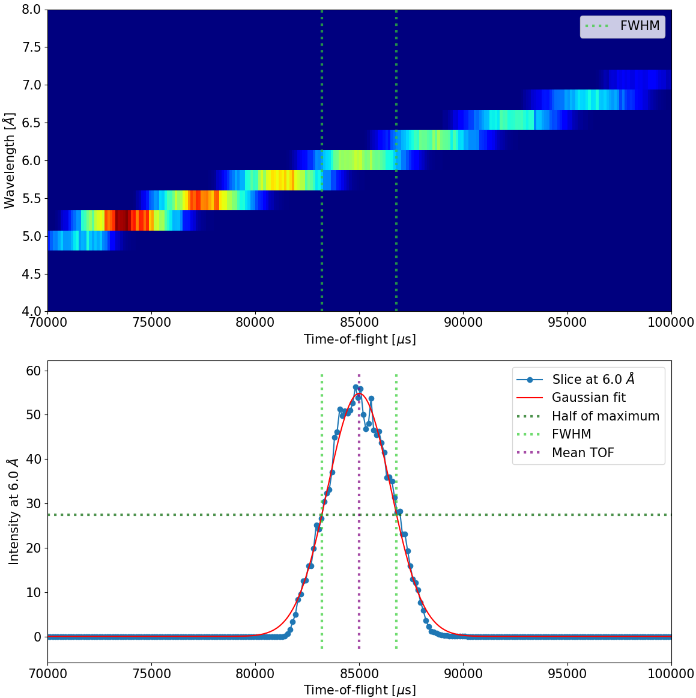

==========
Quickstart
==========

Welcome to ``mcstas_gisans``! This guide will walk you through your first complete simulation from McStas instrument definition to final Q-space plot.

1. Prerequisites
----------------

Ensure that you have cloned the `mcstas_gisans` repository and navigated into it:

.. code-block:: bash

   git clone https://github.com/MilanKlausz/mcstas_gisans.git
   cd mcstas_gisans

Then, install the package via the conda environment defined in ``conda.yml``:

.. code-block:: bash

   conda env create -f conda.yml
   conda activate mcstas_gisans

You must also have an active installation of McStas (version 3.4 or higher) to run the simulation steps below.

2. Running the McStas Simulation
--------------------------------

We will use the predefined D22 instrument model provided in the repository under the ``resources/mcstas_models/`` directory. This model is pre-configured with the required ``MCPL_output`` component at the sample position.

To generate the incident neutron states, run the McStas simulation using the ``mcrun`` command (this assumes you have the ``mcstas-3.4-environment`` activated, or your system's equivalent McStas path):

.. code-block:: bash

   mcrun -c resources/mcstas_models/d22_lss_mcstas_3_4_MCPL.instr -n 1e6 -d resources/mcstas_models/output_dir \
     lambda=6.0 dlambda=0.6 coll_len=14.4 sample_size_x=0.01 sample_size_y=0.05 \
     sample_size_z=0.01 sx=0.04 sy=0.04

*(Note: In McStas, the ``-n 1e6`` flag specifies the total number of initial neutron rays to simulate from the source.)*

This will generate an ``resources/mcstas_models/output_dir/test_events.mcpl.gz`` file containing the incident neutrons arriving at the sample position.

3. Running the BornAgain DWBA Simulation
----------------------------------------

Next, we process these neutrons through the BornAgain sample physics engine using the ``mg_run`` utility. 

Here we simulate a standard ``silica_100nm_D2O`` model, defining the instrument (``-i d22``), the monochromatic wavelength (``--wavelength_selected 6.0``), and restricting to 100 outgoing directions per incoming ray (``-n 100``) for speed:

.. code-block:: bash

   mg_run resources/mcstas_models/output_dir/test_events.mcpl.gz -i d22 \
     --wavelength_selected 6.0 \
     --model silica_100nm_D2O \
     -n 100 \
     --savename test_q \
     --specular include_specular

*(Note: In mg_run, the ``-n 100`` flag specifies how many BornAgain scattering directions to sample per incoming MCPL neutron, which is different from the McStas source neutron count!)*

This will run the DWBA calculation and automatically save the output as ``test_q.h5`` in your current directory.

4. Visualizing the Results
--------------------------

Finally, use the ``mg_plot`` utility to visualize the computed spatial intensity as a function of the momentum transfer :math:`(Q_y, Q_z)`. 

We will upscale the Monte Carlo result to 1 hour of experimental time (``-t 3600``) and apply Poisson noise for realistic visual comparison. 

.. code-block:: bash

   mg_plot -f test_q.h5 -t 3600

This command will pop up a matplotlib window displaying the simulated GISANS pattern.

What's Next?
------------

- Having issues? Head over to the :doc:`troubleshooting` section.
- Ready to use a custom sample? Read about :doc:`custom_sample`.
- Want to automate fitting? Check out the :doc:`main_workflow` for ``mg_fit``.
