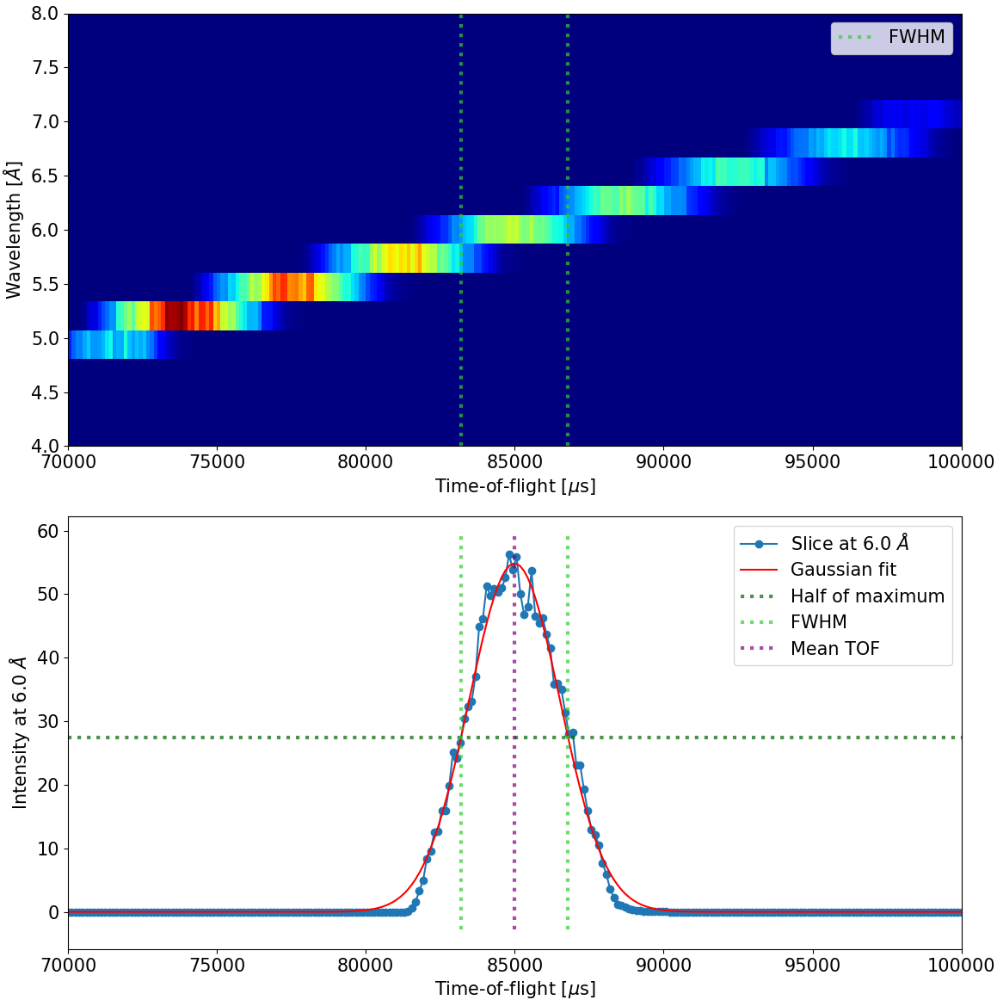

==========
Quickstart
==========

Welcome to ``mcstas_gisans``! This guide will walk you through your first complete simulation from McStas instrument definition to final Q-space plot.

1. Prerequisites
----------------

Ensure that you have cloned the `mcstas_gisans` repository and navigated into it:

.. code-block:: bash

   git clone https://github.com/MilanKlausz/mcstas_gisans.git
   cd mcstas_gisans

Then, install the package via the conda environment defined in ``conda.yml``:

.. code-block:: bash

   conda env create -f conda.yml
   conda activate mcstas_gisans

To run the McStas simulation of step 2 you need McStas (version 3.4 or higher). To try the tools without McStas, skip step 2 and use the D22 McStas output included in the repository, ``data/paper/mcstas_output/d22_1e8/test_events.mcpl.gz``, in step 3.

2. Running the McStas Simulation
--------------------------------

We will use the predefined D22 instrument model provided in the repository at ``resources/mcstas_models/ILL_D22.instr``. This model is pre-configured with the required ``MCPL_output_noacc`` component at the sample position (see :doc:`mcstas_preparation` for what this component does and why its placement matters).

To generate the incident neutron states, run the McStas simulation using the ``mcrun`` command (this assumes you have a McStas 3.4+ environment activated, e.g. via ``mcstas-3.4-environment``, or your system's equivalent McStas setup):

.. code-block:: bash

   mcrun resources/mcstas_models/ILL_D22.instr -c -n 1e6 -d resources/mcstas_models/output_dir \
     lambda=6.0 D22_collimation=17.6

*(Note: In McStas, the ``-n 1e6`` flag specifies the total number of initial neutron rays to simulate from the source, ``-c`` forces a recompile, and ``lambda``/``D22_collimation`` are instrument-specific parameters defined in the ``.instr`` file itself.)*

This will generate a ``resources/mcstas_models/output_dir/test_events.mcpl.gz`` file containing the incident neutrons arriving at the sample position.

3. Running the BornAgain DWBA Simulation
----------------------------------------

Next, we process these neutrons through the BornAgain sample physics engine using the ``mg_run`` utility. 

Here we simulate a standard ``silica_100nm_D2O`` model, defining the instrument (``-i d22``), the monochromatic wavelength (``--wavelength_selected 6.0``) and the number of outgoing directions (``-n 20``, the default):

.. code-block:: bash

   mg_run resources/mcstas_models/output_dir/test_events.mcpl.gz -i d22 \
     --wavelength_selected 6.0 \
     --model silica_100nm_D2O \
     -n 20 \
     --savename test_q \
     --specular include_specular

*(Note: ``-n 20`` is the number of BornAgain scattering directions per axis, so each incident MCPL neutron produces 20 × 20 = 400 outgoing rays. The run time grows with its square; it has nothing to do with the McStas source neutron count.)*

This will run the DWBA calculation and save the simulated detector image as ``test_q.h5`` in your current directory.

4. Visualizing the Results
--------------------------

Finally, use the ``mg_plot`` utility to visualize the computed spatial intensity as a function of the momentum transfer :math:`(Q_y, Q_z)`. 

We will upscale the simulated rate to 1 hour of measurement time (``-t 3600``), which also applies Poisson noise for a realistic picture.

.. code-block:: bash

   mg_plot -f test_q.h5 -t 3600

This command will pop up a matplotlib window displaying the simulated GISANS pattern.

What's Next?
------------

- Having issues? Head over to the :doc:`troubleshooting` section.
- Ready to use a custom sample? Read about :doc:`custom_sample`.
- Want to automate fitting? Check out the :doc:`main_workflow` for ``mg_fit``.
