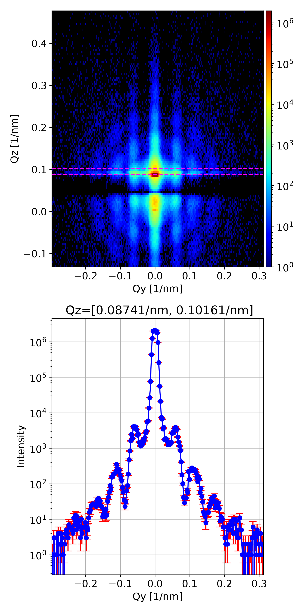
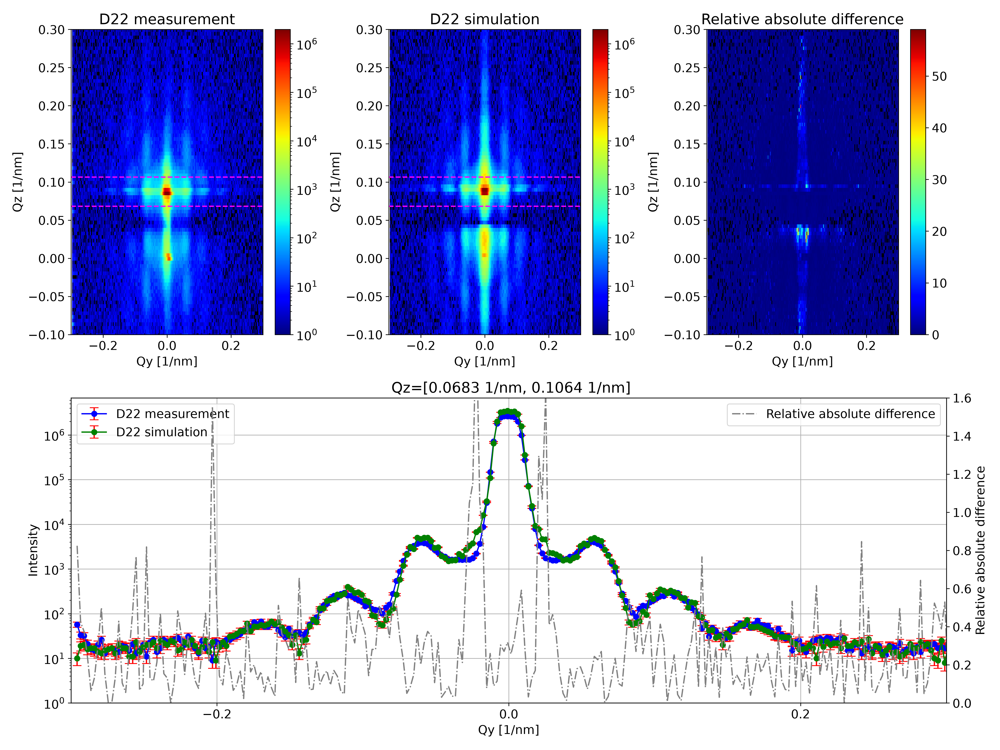

==========
Quickstart
==========

Welcome to ``mcstas_gisans``! This guide will walk you through your first complete simulation from McStas instrument definition to final Q-space plot.

1. Prerequisites
----------------

Ensure that you have cloned the `mcstas_gisans` repository and navigated into it:

.. code-block:: bash

   git clone https://github.com/MilanKlausz/mcstas_gisans.git
   cd mcstas_gisans

Then, install the package via the conda environment defined in ``conda.yml``:

.. code-block:: bash

   conda env create -f conda.yml
   conda activate mcstas_gisans

On macOS, PyPI has no wheel of the default BornAgain 23.0: build it first, or use BornAgain 21 with its limitations
(see :doc:`installation_and_usage`).

Run the simulations in a working directory outside the repository, and keep the location of the repository in a
variable for the commands below:

.. code-block:: bash

   export MG_REPO=$PWD
   mkdir -p ~/mg_quickstart && cd ~/mg_quickstart

The example of this guide is the measurement published with ``mcstas_gisans`` (:doc:`cite`): silica nanoparticles
(100 nm diameter) on a silicon substrate, in air, measured for 3 hours at the D22 instrument (ILL) with 6 Å neutrons at
an incident angle of 0.24°. The measured data and the McStas simulation of the beam of this measurement are included
in the repository (``data/paper``).

To run the McStas simulation of step 2 you need McStas (version 3.4 or higher). To try the tools without McStas, skip
step 2: the following steps use the McStas output included in the repository,
``$MG_REPO/data/paper/mcstas_output/d22_1e9/test_events.mcpl.gz``.

2. Running the McStas Simulation
--------------------------------

The D22 instrument model is provided in the repository at ``resources/mcstas_models/ILL_D22.instr``. It is
pre-configured with the required ``MCPL_output_noacc`` component at the sample position (see
:doc:`mcstas_preparation` for what this component does and why its placement matters).

To generate the incident neutron states, run the McStas simulation using the ``mcrun`` command (this assumes you have a
McStas 3.4+ environment activated, e.g. via ``mcstas-3.4-environment``, or your system's equivalent McStas setup):

.. code-block:: bash

   mcrun $MG_REPO/resources/mcstas_models/ILL_D22.instr -c -n 1e8 -d d22_1e8 \
     lambda=6.0 D22_collimation=17.6

*(Note: In McStas, the ``-n 1e8`` flag specifies the total number of initial neutron rays to simulate from the source,
``-c`` forces a recompile, and ``lambda``/``D22_collimation`` are instrument-specific parameters defined in the
``.instr`` file itself. The McStas output included in the repository was made with the same settings and ``-n 1e9``.)*

This will generate a ``d22_1e8/test_events.mcpl.gz`` file containing the incident neutrons arriving at the sample
position (McStas refuses to write into an existing output directory: choose a new ``-d`` for every run). To use it,
replace the MCPL file in the commands below.

3. Running the BornAgain DWBA Simulation
----------------------------------------

Next, we process these neutrons through the BornAgain sample physics engine using the ``mg_run`` utility, with the
built-in ``silica_100nm_air`` model of the sample and the settings of the measurement:

.. code-block:: bash

   mg_run $MG_REPO/data/paper/mcstas_output/d22_1e9/test_events.mcpl.gz \
     --instrument d22 --wavelength_selected 6.0 --intensity_factor 0.2107 \
     --model silica_100nm_air --sample_arguments "radius=51;interferenceRange=5;latticeParameter=114" \
     --sample_size_y 0.06 --sample_size_x 0.08 --allow_sample_miss \
     --alpha 0.24 --sample_orientation 2 --instrument_detector_centre_offset 0.290838 -0.016061 \
     --specular specular_simulation \
     --savename paper_sim

- ``--instrument d22 --wavelength_selected 6.0``: the instrument and its monochromatic wavelength.
- ``--intensity_factor 0.2107``: scales the McStas intensity to the measured one (from the direct beam measurement,
  see :doc:`replicating_measurements`).
- ``--model`` and ``--sample_arguments``: the sample model and its parameters (sphere radius 51 nm, 5 × 5 spheres in
  hexagonal crystallites with a lattice parameter of 114 nm; see :doc:`custom_sample` for models and their parameters).
- ``--sample_size_y``/``--sample_size_x``: the size of the sample (6 cm × 8 cm); with ``--allow_sample_miss`` the
  neutrons that miss it still reach the detector.
- ``--alpha 0.24 --sample_orientation 2``: the incident angle, and the orientation of the sample (vertical, with its
  surface normal pointing left, looking along the beam).
- ``--instrument_detector_centre_offset``: the position of the detector relative to the beam in this measurement,
  found from the direct beam measurement (:doc:`replicating_measurements`).
- ``--specular specular_simulation``: the specular reflection is added in its exact direction
  (see :doc:`known_issues`).

The number of outgoing directions per neutron is chosen by the ``quick`` sampling preset (see :ref:`sampling_presets`);
the run takes a few minutes on a laptop. By default, ``mg_run`` starts one process per CPU core, and BornAgain starts
its own threads in each of them; on a laptop, ``--parallel_processes 4 --bornagain_number_of_threads 1`` keeps the
computer responsive.

This saves the simulated detector image as ``paper_sim.h5`` in your current directory.

4. Visualizing the Results
--------------------------

Use the ``mg_plot`` utility to visualize the simulated intensity as a function of the momentum transfer
:math:`(Q_y, Q_z)`. Here the simulated rate is upscaled to the 3 hours of the measurement (``-t 10800``), which also
applies Poisson noise for a realistic picture:

.. code-block:: bash

   mg_plot -f paper_sim.h5 -t 10800 --dual_plot

This command opens a matplotlib window with the simulated GISANS pattern as a function of :math:`(Q_y, Q_z)` (top),
and the :math:`Q_y` profile of the intensity summed over the :math:`Q_z` band marked by the dashed lines (bottom; set
the band with ``--q_min`` and ``--q_max``). With ``--png`` (or ``--pdf``) the figure is saved instead (named with
``--savename``). Without ``--dual_plot``, the two plots are shown one after the other in separate windows.

   *The specular reflection is at* :math:`Q_z \approx 0.09` *nm*\ :sup:`-1`, *the peaks of the nanoparticle lattice at*
   :math:`Q_y \approx \pm 0.06` *and* :math:`\pm 0.11` *nm*\ :sup:`-1`; *the dark band at* :math:`Q_z \approx 0.05`
   *nm*\ :sup:`-1` *is the sample horizon.*

5. Comparing with the Measurement
---------------------------------

``mg_plot`` reads measured NeXus files as well, and interprets them with the instrument configuration stored in the
simulation file (orientation, incident angle, detector offset):

.. code-block:: bash

   mg_plot --filename paper_sim.h5 --label "D22 simulation" \
     --nxs $MG_REPO/data/paper/d22_measurement/073174.nxs --nxs_label "D22 measurement" \
     --experiment_time 10800 --background 1.6 --overlay --plot_differences 1 \
     --intensity_min 1 --z_plot_range -0.1 0.3 --y_plot_range -0.3 0.3 --q_min 0.072 --q_max 0.102

``--background 1.6`` adds a flat background of 1.6 counts per pixel to the simulation, ``--overlay`` shows the
datasets side by side and their :math:`Q_y` profiles in one plot, and ``--plot_differences 1`` adds the relative
difference between them.

   *The measurement (left), the simulation (middle), their relative difference (right) and the* :math:`Q_y` *profiles
   of the band between the dashed lines (bottom).*

To fit the sample parameters to the measurement, see :doc:`fitting_guide` (its section 9 fits this example).

What's Next?
------------

- Having issues? Head over to the :doc:`troubleshooting` section.
- Ready to use a custom sample? Read about :doc:`custom_sample`.
- Want to automate fitting? Check out the :doc:`main_workflow` for ``mg_fit``.
