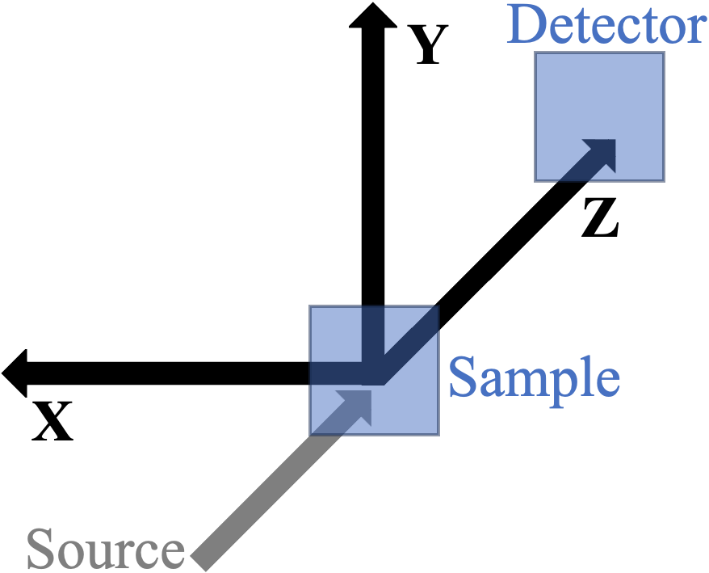
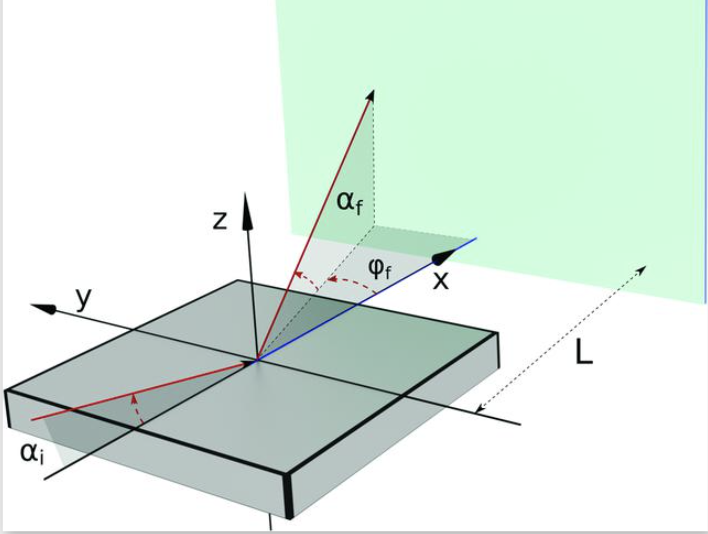
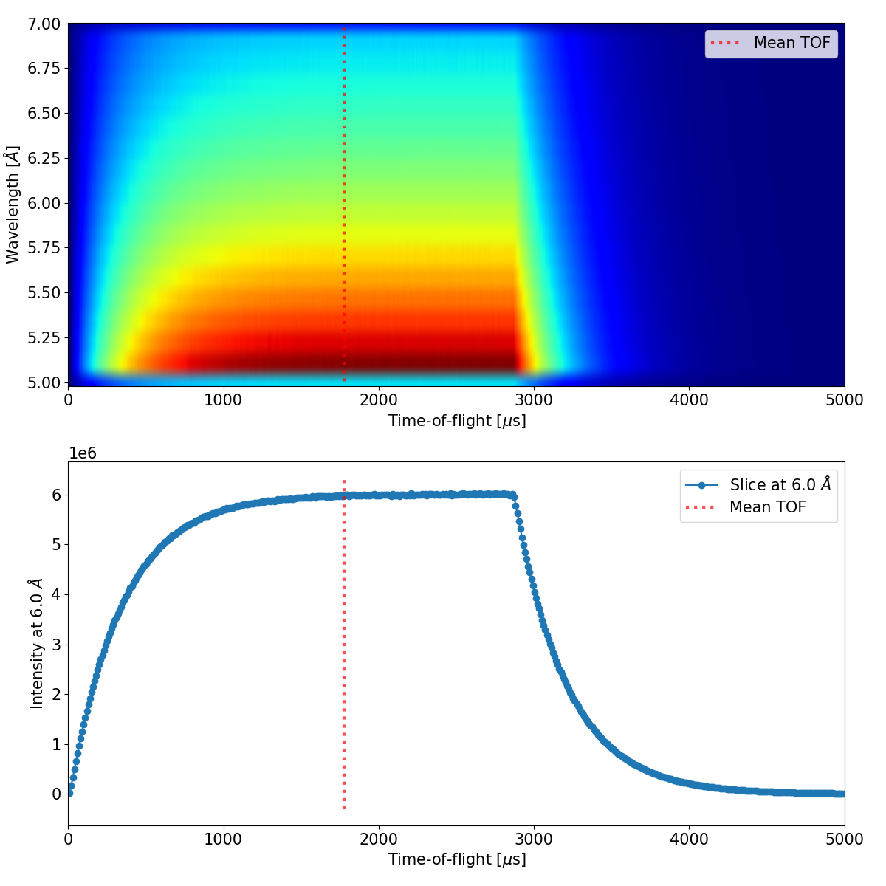

===============================
Architecture & Workflow Details
===============================

This document provides in-depth technical details about the architecture of `mcstas_gisans`, the simulation workflows, and the data structures used.

1. Workflows: TOF vs. Non-TOF
-----------------------------

The simulation workflow diverges depending on whether the experiment utilizes Time-of-Flight (TOF) data or non-TOF data (this is controlled by the ``tof_instrument`` key for the selected instrument in ``instrument_defaults.py``, see :ref:`instrument_defaults_schema` below):

* **Non-TOF Workflow**: The ``mg_run`` (via ``run.py``) script simulates the particles and bins them into a single count (with variance) per detector pixel, stored as a flat ``sc.DataArray`` indexed by ``detector_id`` (see :doc:`scipp_output_format`). Downstream tools reshape this using the detector's pixel grid for 2D plotting.
* **TOF Workflow**: The simulation produces intermediate event-based datasets. Events are preserved with their weight and time-of-flight information. These events are saved into the same Scipp HDF5 (``.h5``) output file. Currently, the data is exclusively saved in **binned (event-mode)** format, preserving the exact TOF of every particle rather than pre-histogramming it — this keeps output files precise but means their size scales with the number of simulated events, not with a fixed number of TOF bins. The binning into final Q-space or detector space is performed flexibly afterwards (e.g. via ``mg_plot --wavelength_slice``), allowing for dynamic slicing and filtering without needing to rerun the BornAgain simulation.

TOF-specific pre-processing (``mg_run``/``mg_fit``, TOF instruments only)
~~~~~~~~~~~~~~~~~~~~~~~~~~~~~~~~~~~~~~~~~~~~~~~~~~~~~~~~~~~~~~~~~~~~~~~~~

Two optional, McStas-monitor-driven corrections are applied to the input MCPL particles before the BornAgain simulation, both handled by ``tof_filtering.py``/``preconditioning.py`` and controlled by the *MCPL filtering* and *T0 correction* argument groups of ``mg_run``/``mg_fit`` (see :doc:`cli_reference`):

* **MCPL TOF filtering** (``get_tof_filtering_limits``): if a central ``--wavelength`` is given (and filtering isn't disabled with ``--no_mcpl_filtering``), the TOFLambda-vs-wavelength spectrum from the instrument's ``mcpl_monitor_name`` McStas monitor (found next to the input MCPL file) is sliced at that wavelength, a Gaussian is fitted to the resulting 1D TOF distribution, and only particles within one FWHM of the fitted mean are kept. Explicit TOF limits can be supplied directly with ``--input_tof_limits`` to skip the monitor fit. ``--tof_filtering_figure`` plots the fit and exits without simulating.
* **T0 correction** (``apply_t0_correction``): subtracts a constant t0 from the TOF of every particle, either a fixed value (``--t0_fixed``, e.g. calculated from chopper settings) or the mean (weighted average, not a fit) of the TOF spectrum in the wavelength bin containing ``--wavelength`` of the instrument's ``t0_monitor_name`` McStas monitor placed at the source position. See :ref:`t0_correction_section` below. Disable with ``--no_t0_correction``; visualise with ``--t0_correction_figure``.

2. Coordinate Systems & Transformations
---------------------------------------

The framework is careful to keep two distinct coordinate systems consistent, implemented in ``coordinates.py`` (``CoordinateTransform``):

* **NeXus system** (used for MCPL input, experimental NeXus data, and detector output): X = horizontal (left), Y = vertical (up), Z = longitudinal (beam direction, forward).
* **BornAgain system** (used only internally, around the sample interaction): X = longitudinal (forward), Y = horizontal (left), Z = vertical (up, i.e. the sample-normal direction).

Incoming particles are transformed NeXus → BornAgain before the DWBA calculation (``preconditioning.py``), and outgoing scattered rays are transformed back BornAgain → NeXus before detector-hit projection. Two effects are folded into this transform:

* **Sample orientation** (``--sample_orientation``, one of ``0``/``1``/``2``): a rotation of the sample around the beam axis, so that the same sample model can describe a vertical sample (surface normal pointing right, ``0``, or left, ``2``) as well as the default horizontal one (``1``). The mapping of both vectors (particles, gravity, detector offset) and raw detector images is derived from this single transformation, so the two can never disagree.
* **Sample inclination** (``-a``/``--alpha``, the incident grazing angle) plus the **beam angle** (``--instrument_beam_angle``, default 0): a rotation in the plane of incidence so that the incoming beam meets the sample at exactly the intended grazing angle in the BornAgain frame. The beam angle is the angle of the incident beam above the nominal beam axis, positive towards the sample surface normal (opposite sign to the former "beam declination angle"). It must describe the mean direction of the simulated (MCPL) beam at the sample; ``mg_run`` prints an estimate from the MCPL particle velocities and warns if it disagrees with the value used. In the reduction of measured data it cancels (the detector offset and Q use the same value).

.. _q_convention:

Q convention and gravity
~~~~~~~~~~~~~~~~~~~~~~~~

Gravity is handled in two places:

* **Simulation** (``mg_run``): every scattered ray is propagated ballistically from the sample to the detector plane (flight time from the longitudinal velocity, position lowered by :math:`\tfrac12 g t^2`), so the simulated detector image contains the true gravity drop of each neutron.
* **Q calculation** (reduction of measured and simulated detector images, ``mg_plot``/``mg_fit``, and TOF events): only quantities known in a real measurement are used — the detection pixel, the wavelength (the selected wavelength for monochromatic instruments, or the wavelength derived from the time of flight and the nominal flight path for TOF instruments), the incident angle and the detector geometry. The convention is the one of Mantid (``Q1D``/``Qxy`` with gravity) and scippneutron/esssans: the incident direction is the straight beam axis at the sample, and the outgoing direction is the *launch* direction of the neutron, i.e. the direction to the detection point raised by the gravity drop accumulated over the flight path at that wavelength:

  .. math::

     \mathbf{Q} = k\left(\hat{\mathbf u}_\mathrm{out} - \hat{\mathbf u}_\mathrm{in}\right),\qquad
     \hat{\mathbf u}_\mathrm{out} \propto \mathbf P + \tfrac12 g\,t^2\,\hat{\mathbf y},\qquad
     t = |\mathbf P| / v(\lambda),\qquad k = 2\pi/\lambda .

Combined with a detector offset defined relative to the undeflected beam axis (``mg_beam_centre_correction``), the unscattered beam maps to :math:`Q = 0` at every wavelength, and the specular reflection to :math:`Q_z = 2k\sin\alpha`. For a monochromatic instrument this agrees to first order with the ILL convention (GRASP; Mantid ``SANSILLReduction``), where :math:`Q = 0` is the centroid of the measured direct beam and no gravity correction is applied. These properties are checked by ``tests/test_physics_invariants.py``.

The 1D Q axes used for plotting and Q-defined masks are evaluated exactly along the two detector lines through the landing point of the unscattered beam; treating them as separable is a (second-order) approximation far from these lines.

**Plotting convention**: independent of the above, ``mg_plot`` always draws :math:`Q_y` on the horizontal plot axis and :math:`Q_z` on the vertical plot axis.

**Limitation**: the detector is currently assumed to be a flat, vertical surface in the NeXus frame (fixed distance and orientation relative to the sample). Curved or tilted detectors are not supported without further coordinate work.

.. _instrument_defaults_schema:

4. Instrument Configuration Reference (``instrument_defaults.py``)
--------------------------------------------------------------------

Every instrument known to ``mcstas_gisans`` (selected via ``-i``/``--instrument`` on ``mg_run``/``mg_plot``/``mg_fit``, or ``--instrument`` on ``mg_beam_centre_correction``) is a plain Python dict entry in the ``instrument_defaults`` dictionary at the top of ``src/mcstas_gisans/instrument_defaults.py``. Adding support for a new instrument means adding a new key there (and, optionally, McStas monitors so the automated TOF filtering/T0 correction described above can work).

Required keys:

* ``nominal_source_sample_distance`` (float, m): distance from the McStas source to the sample position. Used for T0/TOF-related calculations; can be overridden per run with ``--instrument_nominal_source_sample_distance``.
* ``sample_detector_distance`` (float, m): distance from the sample to the detector, along the beam axis. Overridable with ``--instrument_sample_detector_distance``.
* ``tof_instrument`` (bool): whether the instrument is Time-of-Flight (``True``, e.g. SAGA/LOKI/SKADI) or monochromatic (``False``, e.g. D22). This selects which of ``--wavelength``/``--wavelength_selected`` is required, and whether the TOF workflow described above applies. Overridable with ``--instrument_tof_instrument true|false``.

Optional keys:

* ``detector`` (dict): overrides the module-level ``default_detector`` for this instrument. If given, must define all of:

  * ``size`` — ``[size_x, size_y]`` in meters.
  * ``direct_beam_centre_offset`` — ``[offset_x, offset_y]`` in meters; the position of the detector centre relative to the undeflected beam axis through the sample (NeXus frame), as computed by ``mg_beam_centre_correction``. Independent of the sample orientation.
  * ``pixels`` — ``[pixels_x, pixels_y]`` pixel counts.
  * ``resolution`` — ``[res_x, res_y]`` detector position resolution, FWHM in meters (``0.0`` disables resolution smearing on that axis).

  All of the above are individually overridable per run with ``--instrument_detector_size``, ``--instrument_detector_centre_offset``, ``--instrument_detector_pixels``, ``--instrument_detector_resolution`` (and the ``--nxs_instrument_*`` equivalents on ``mg_plot``/``mg_fit`` for the separately-configurable NeXus/experimental instrument).
* ``mcpl_monitor_name`` (str): name of a McStas *TOFLambda_monitor* placed at the sample position, used for MCPL TOF filtering (see :ref:`sample_position_monitors`).
* ``t0_monitor_name`` (str): name of a McStas *TOFLambda_monitor* placed at the source position, used for T0 correction (see :ref:`source_position_monitors`). Overridable with ``--instrument_t0_monitor_name``.
* ``wfm_t0_monitor_name`` and ``wfm_virtual_source_distance`` (str, float [m]): together enable Wavelength Frame Multiplication (``--wfm``) mode; see :ref:`virtual_source_position_monitors`. Both are required for ``--wfm`` to be accepted for an instrument (checked against ``required_keys_for_wfm``). Overridable with ``--instrument_wfm_t0_monitor_name``/``--instrument_wfm_virtual_source_distance``.
* ``beam_angle`` (float, deg): a default beam angle for the instrument (see above; 0 if unset). Overridable with ``--instrument_beam_angle``.

See :doc:`mcstas_preparation` for how to instrument a McStas model with the monitors these keys refer to.

3. Simulation of each neutron
-----------------------------

Coordinate transformation
~~~~~~~~~~~~~~~~~~~~~~~~~

McStas uses the NeXus coordinate system (z along the beam, x horizontal pointing left as seen from the source, y up). In BornAgain the average sample surface defines the *xy* plane, always called "horizontal" regardless of the orientation of the sample in the laboratory, and the mean incident beam lies in the *xz* plane, arriving from the quadrant x<0, z>0. With the *MCPL_output* component placed at the sample position (see :doc:`mcstas_preparation`), the particles are already expressed relative to a sample at the origin, so only rotations are needed: first the sample orientation (a rotation around the beam axis for vertical samples), then the incident angle (a rotation in the plane of incidence). Since the incident angle is an input of the transformation, simulating other incident angles does not require re-running McStas (unless other instrument settings are needed).

*Coordinate systems: (left) the* `NeXus coordinate system <https://manual.nexusformat.org/design.html#the-nexus-coordinate-system>`__ *used in McStas, as viewed from the detector; (right) the geometric conventions in BornAgain* [`Source <https://www.ncbi.nlm.nih.gov/pmc/articles/PMC6998781/figure/fig4/>`__].

Propagation to the sample surface
~~~~~~~~~~~~~~~~~~~~~~~~~~~~~~~~~

Particles are propagated in a straight line to the sample surface (z = 0 in the BornAgain frame, :math:`t = -z/v_z`). Particles outside the ``--sample_size_x`` × ``--sample_size_y`` area are discarded before the BornAgain simulation, unless ``--allow_sample_miss`` is given: then they are left where they are and propagated to the detector without scattering (transmission without refraction, with gravity). This allows simulating over-illumination, or a direct beam by also setting one of the sample sizes to zero.

.. _t0_correction_section:

T0 correction (TOF instruments)
~~~~~~~~~~~~~~~~~~~~~~~~~~~~~~~

The T0 correction accounts for the pulse width of the source. It is only needed for the data reduction: BornAgain uses the true wavelength of each particle for the neutron–sample interaction, while the reduction derives the wavelength from the TOF and the flight path, as in a real measurement. Without the correction, the TOF of every neutron would be overestimated by its emission time within the pulse. Subtracting the mean emission time of neutrons of the wavelength of interest shifts the TOF reference from the start of the pulse to its "centre": roughly half of the neutrons get a slightly underestimated and half a slightly overestimated TOF, so the uncertainty caused by the pulse width is included just as in a real TOF measurement.

   Defining t0 from a TOF–wavelength McStas monitor at the source position (top): the wavelength bin containing the wavelength of interest (6.0 Å) is selected and t0 is the weighted average of its TOF spectrum (bottom).

.. _wfm_mode_section:

In Wavelength Frame Multiplication mode (``--wfm``) the mean is taken only over the sub-pulse containing the selected wavelength (sub-pulse limits are currently hardcoded for SAGA), from the ``wfm_t0_monitor_name`` monitor, and the flight path used to calculate the wavelength is shortened by ``wfm_virtual_source_distance``, because the corrected TOF refers to the virtual source.

Outgoing directions
~~~~~~~~~~~~~~~~~~~

For each incident neutron a BornAgain simulation is run with a spherical detector of ``--outgoing_directions_horizontal`` × ``--outgoing_directions_vertical`` bins (``-n`` sets both) covering ``--angle_range`` (by default derived from the detector size and distance). The wavelength is that of the particle and the beam intensity its statistical weight. BornAgain evaluates the cross section at the bin centres; for each neutron the whole grid is shifted by a random amount of up to half a bin, so that the outgoing rays of all neutrons sample the angle range uniformly instead of always pointing at the same directions. This is the same Monte Carlo integral as BornAgain's own Monte Carlo integration option, but here the intensity is carried by rays in different directions, which matters because the rays are propagated further to the detector.

Each incident neutron therefore produces one outgoing ray per bin, with the weight of the incident neutron times the probability of scattering into that bin (the differential cross section times the solid angle of the bin). The rays are propagated from the scattering point to the detector plane with gravity (unless ``--no_gravity``). The hit position is smeared with the detector resolution (Gaussian with the given FWHM; it should only describe the detection process — conversion, charge spread, electronics — since the pixelation is applied separately) and assigned to a pixel. Q is then calculated from the pixel, as for a measurement (:ref:`q_convention`). The Monte Carlo randomness (grid shift, resolution smearing) is seeded per particle from ``--seed``, so results are reproducible and independent of the number of processes.

.. _sampling_presets:

Choosing the number of outgoing directions (``--sampling``)
^^^^^^^^^^^^^^^^^^^^^^^^^^^^^^^^^^^^^^^^^^^^^^^^^^^^^^^^^^^^

Because of the random grid shift, any number of outgoing directions gives an unbiased result: a coarse grid does not blur the pattern, it only adds statistical noise. Each neutron's rays land in different pixels, so the pixels are filled by the rays of *many* neutrons, and the number of directions does not have to match the number of detector pixels. What matters is how many rays a pixel collects over the whole run,

.. math::

   R = N_\mathrm{hit} \, \rho ,

where :math:`N_\mathrm{hit}` is the number of incident neutrons that hit the sample and :math:`\rho` the number of outgoing directions per detector pixel of angular area within the simulated angle range. The relative noise per pixel is about :math:`1.5/\sqrt{R}` (measured for the D22 paper data: 10% at :math:`R \approx 250`, 3.4% at 2000, 1.7% at 7000). The more neutrons the MCPL file contains, the fewer directions are needed for the same noise.

``--sampling quick|standard|long`` chooses the grid for a target of :math:`R` = 250 / 2000 / 10000 rays per pixel (about 10% / 3% / 1.5% noise per pixel); ``--rays_per_pixel`` sets a custom target. The grid is computed once per run, after the particles are preconditioned and the final simulated angle range is known (``--angle_range``, the full detector, or for ``mg_fit`` with ``--simulate_mask_angle_range`` the mask range including its margins): :math:`\rho = R/N_\mathrm{hit}`, and the directions are split so that both axes have the same bin width in units of detector pixels, :math:`n_\mathrm{h,v} = \lceil \sqrt{\rho}\, P_\mathrm{h,v} \rceil`, where :math:`P_\mathrm{h,v}` is the number of detector pixels spanned by the angle range along the horizontal and vertical axis (pixel size divided by the sample-detector distance; for vertical samples the axes of the detector are swapped). The chosen numbers are printed together with the options that reproduce them, e.g.::

   Outgoing directions: 74 x 3 (sampling 'quick': about 269 rays per detector pixel (target 250) from 1710 neutrons hitting the sample, expected noise about 9.1% per pixel). To reproduce: --outgoing_directions_horizontal 74 --outgoing_directions_vertical 3

The printed number of rays can exceed the target, because the numbers of directions are rounded up (noticeably when an axis spans only a few pixels). Explicit ``-n``/``--outgoing_directions`` or ``--outgoing_directions_horizontal``/``--outgoing_directions_vertical`` always override the presets (the two cannot be combined); without any of these options the default grid of 20 × 20 is used.

The margin added around a fit region (``--simulate_mask_angle_range``) enlarges the simulated angle range, so the same target needs more directions (the directions per pixel stay the same, the extra rays land outside the region). The margin is still needed: because of the beam divergence and the beam spot, directions just outside the region reach its edge pixels for some neutrons, and without them these pixels would lose intensity.

5. Core Tools and Modules
-------------------------

With the modularization of the codebase, specific tasks are handled by dedicated scripts under ``src/mcstas_gisans/``:

* **nexus_reader.py**: Converts experimental NeXus detector pixel data into Q-space using the same ``Instrument`` object parameters as the simulation, for direct comparison. By default the detector data is looked up at one of two known ILL D22 HDF5 layouts (``entry0/D22/Detector 1/data1`` or ``entry0/data1/MultiDetector1_data``); ``--nxs_data_path`` overrides this with an explicit HDF5 path for NeXus files from other facilities or layouts. It also provides ``read_nexus_duration()``, used to weakly cross-check ``--experiment_time`` against the measurement duration reported in the NeXus file itself (see :doc:`main_workflow`).
* **instrument.py**: The ``Instrument`` class — wraps an instrument's ``instrument_defaults`` entry together with the run's alpha/wavelength/orientation to expose detector geometry, pixel positions, and Q-space conversions.
* **coordinates.py** / **preconditioning.py**: Coordinate transformations and MCPL particle preconditioning (T0 correction, coordinate frame conversion, beam-angle calculation), see above.
* **tof_filtering.py**: Derives MCPL TOF acceptance limits from a McStas monitor fit, see above.
* **masking.py**: Builds the boolean Q-space masks used by ``mg_fit`` (``--mask_*`` options) and the ``--mask_view`` visualization.
* **fit.py (mg_fit)**: Runs parameter scans and automated fitting/optimization; see :doc:`main_workflow`.
* **beam_centre_correction.py**: Finds the detector ``direct_beam_centre_offset`` from a direct-beam NeXus measurement (the measured direct beam is then at :math:`Q = 0`), and optionally cross-checks it with a simulated direct beam and measures the incident angle from the specular spot (see :doc:`replicating_measurements`).

6. Testing
----------

Run the tests with ``pytest`` from the repository root (the regression tests call ``mg_run``/``mg_fit``, which must be on the ``PATH``). Besides unit tests of the individual modules, ``tests/test_physics_invariants.py`` checks physical properties that do not depend on the implementation, for all sample orientations: gravity pulls neutrons down in the laboratory, the unscattered beam is at :math:`Q = 0` and the specular reflection at :math:`Q_z = 2k\sin\alpha`, detector images and simulated hits use the same orientation convention. The regression tests (``test_d22_regression.py``, ``test_fit_masked_single_eval.py``) run seeded simulations of the D22 paper data and check the loss against the measurement.

7. BornAgain Compatibility
---------------------------

The core ``mcstas_gisans`` framework is compatible with **BornAgain 21.2, 22.2, 23.0 and 24.1**.
*(Note: individual custom sample models defined in the ``bornagain_samples/`` directory may require minor syntax adjustments depending on the specific BornAgain version being used, due to deprecations in BornAgain's Python API across these versions — see the version-specific ``silica_100nm_air_ba22_ba23``/``silica_100nm_air_ba24`` built-in models for examples. See :doc:`installation_and_usage` for how to select a BornAgain version.)*
